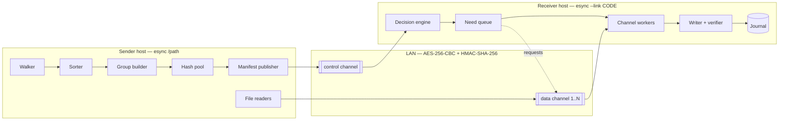
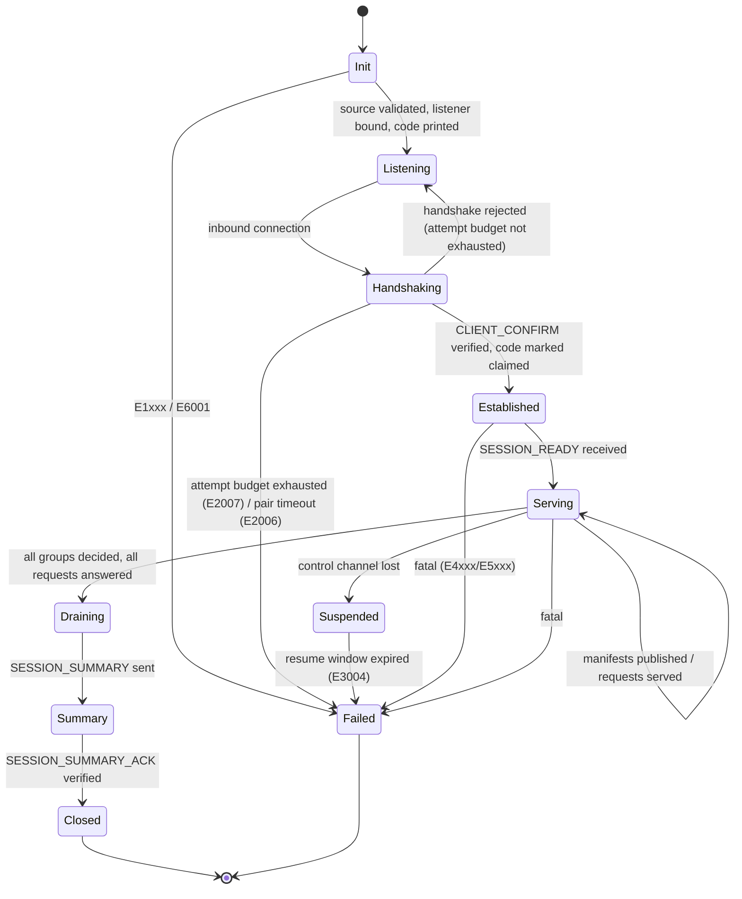
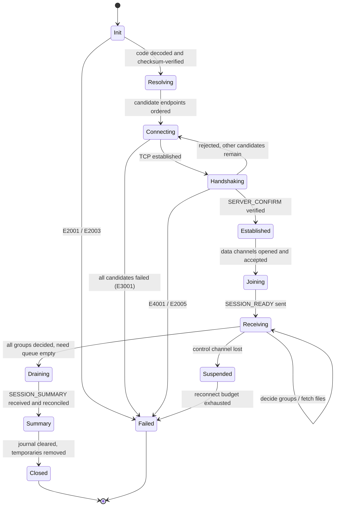

# esync — Architecture Specification

| Field | Value |
|---|---|
| Document ID | ESYNC-ARCH |
| Version | 0.2.0 (baselined) |
| Status | **Approved** — decisions confirmed by the user 2026-09-04 |
| Date | 2026-09-04 |
| Protocol version | `1` |
| Implements | [INITIAL_REQS.md](INITIAL_REQS.md) (ESYNC-REQ v0.2.0) |
| Language | Go 1.27 (`module esync`) |

> **No code exists yet.** This document is the contract that code will be written against. Every
> normative statement carries the requirement ID it satisfies, and §18 proves that the mapping is
> total in both directions. All open points are decided (ESYNC-REQ §13); this specification is
> ready to implement against.

---

## Table of Contents

1. [Design Principles](#1-design-principles)
2. [System Overview](#2-system-overview)
3. [Component Model](#3-component-model)
4. [Session Lifecycle](#4-session-lifecycle)
5. [Pairing Code](#5-pairing-code)
6. [Security Architecture](#6-security-architecture)
7. [Transport and Channel Model](#7-transport-and-channel-model)
8. [Record Layer](#8-record-layer)
9. [Message Catalogue](#9-message-catalogue)
10. [Enumeration, Ordering, and Grouping](#10-enumeration-ordering-and-grouping)
11. [Hashing and Change Detection](#11-hashing-and-change-detection)
12. [Transfer Engine](#12-transfer-engine)
13. [Concurrency and Flow Control](#13-concurrency-and-flow-control)
14. [Error Model](#14-error-model)
15. [Observability](#15-observability)
16. [Configuration Surface](#16-configuration-surface)
17. [Package Layout](#17-package-layout)
18. [Traceability](#18-traceability)
19. [Verification Strategy](#19-verification-strategy)
20. [Deviations, Risks, and Deferred Work](#20-deviations-risks-and-deferred-work)

---

## 1. Design Principles

These are the tie-breakers. When two designs are otherwise equal, the one that satisfies the
higher-numbered principle loses.

| # | Principle | Consequence |
|---|---|---|
| **P1** | **No silent success.** | Every path ends in an explicit, agreed outcome. Truncated sessions, unverified files, and skipped errors are failures, not successes. `REQ-SEC-007`, `REQ-PROTO-009` |
| **P2** | **The receiver never trusts the sender's bytes.** | Path validation, containment checks, and digest verification happen on the receiving side, always. `REQ-SEC-015`, `REQ-FS-040` |
| **P3** | **Everything is bounded.** | Every queue, pool, buffer, allocation, and wait has a documented ceiling and a timeout. `REQ-PAR-003`, `REQ-NET-010`, `REQ-SEC-014` |
| **P4** | **Determinism where it is observable.** | Grouping, ordering, and IDs are pure functions of the tree. Reproducibility is testable. `REQ-SCAN-020` |
| **P5** | **The pipeline never stalls on the slowest stage's slowest item.** | Scan, hash, decide, and transfer overlap; backpressure is explicit, not incidental. `REQ-PAR-006`, `REQ-PAR-008` |
| **P6** | **Observability is a feature, not instrumentation.** | Trace context is threaded through the domain types, not bolted on. `REQ-OBS-010` |
| **P7** | **Fail per-item before failing the session.** | One unreadable file must not cost the other 99,999. `REQ-ERR-002` |
| **P8** | **Leave nothing behind.** | One-shot means no daemon, no config, no residue. `REQ-NFR-003` |

---

## 2. System Overview



### 2.1 Roles

The **sender** owns the truth about the source tree and is the only party that can read it. The
**receiver** owns the decision about what is worth moving and the pace at which it can be absorbed.
This split is deliberate: the receiver is the only party that knows what it already has
(`REQ-HASH-003`) and how fast its disk can write (`REQ-PAR-002`), so it drives (`REQ-PROTO-004`).

### 2.2 The four data flows

| Flow | Direction | Channel | Volume |
|---|---|---|---|
| Manifests (identity + digest of 1024 files) | S → R | control | ~120 KB per group |
| Decisions and credit | R → S | control | ~2 KB per group |
| File requests | R → S | data *i* | ~32 B each |
| File content | S → R | data *i* | bulk |

Keeping the first two off the bulk channels is what guarantees the control plane stays responsive
under load (`REQ-NET-005`).

---

## 3. Component Model

### 3.1 Shared components

| Component | Responsibility | Requirements |
|---|---|---|
| `paircode` | Encode/decode the pairing code; endpoint discovery; checksum. | `PAIR-001`..`PAIR-006` |
| `crypto/handshake` | Authenticated key agreement, key schedule, confirmation. | `SEC-003`..`SEC-013` |
| `crypto/record` | Encrypt-then-MAC record layer, sequence discipline. | `SEC-001`..`SEC-006` |
| `wire` | Frame codec, message structs, bounds checking. | `PROTO-001`, `SEC-014` |
| `channel` | Connection lifecycle, keepalive, reconnect, channel identity. | `NET-004`..`NET-010` |
| `fsx` | Platform filesystem abstraction: path rules, metadata, atomic publish, sparse writes. | `FS-*` |
| `digest` | Pluggable content digest + resumable state + cache. | `HASH-001`..`HASH-006` |
| `obs` | Levels, fields, spans, counters, redaction, sinks, ring buffer. | `OBS-*` |
| `fault` | Typed errors, classification, retry policy, exit-code mapping. | `ERR-*` |

### 3.2 Sender-only components

| Component | Responsibility |
|---|---|
| `sender/walk` | Bounded-memory recursive enumeration with loop and boundary control. |
| `sender/order` | Deterministic ordering; in-memory or external merge sort above the spill threshold. |
| `sender/manifest` | Group assembly, hash scheduling, credit-gated publication. |
| `sender/serve` | Per-data-channel request servicing and content streaming. |

### 3.3 Receiver-only components

| Component | Responsibility |
|---|---|
| `receiver/decide` | Local stat + digest, needed/skip decision, decision emission. |
| `receiver/queue` | Ordered, bounded, resumable work queue with largest-first tail shaping. |
| `receiver/fetch` | Channel workers: request, stream, verify, publish. |
| `receiver/journal` | Crash-safe record of completed and partial work. |
| `receiver/tune` | Adaptive channel-count controller. |

---

## 4. Session Lifecycle

### 4.1 Sender state machine



### 4.2 Receiver state machine



### 4.3 Nominal sequence

```mermaid
sequenceDiagram
  autonumber
  participant U as User
  participant S as Sender
  participant R as Receiver

  U->>S: esync /path
  S->>S: validate path, bind listener, derive secret
  S-->>U: pairing code (stdout)
  U->>R: esync --link CODE
  R->>S: TCP connect (candidates in parallel)
  R->>S: CLIENT_HELLO {sid, nonce_c, Pc}
  S->>R: SERVER_HELLO {nonce_s, Ps}
  S->>R: SERVER_CONFIRM {HMAC(transcript)}
  R->>S: CLIENT_CONFIRM {HMAC(transcript)}
  Note over S,R: code claimed; keys installed; all later traffic encrypted
  S->>R: SESSION_PARAMS {root, hash alg, group size, flags}
  R->>S: SESSION_READY {channels, credit, pipeline depth}
  R->>S: CHANNEL_JOIN x N (new connections)
  S->>R: CHANNEL_ACCEPT x N
  par Scan pipeline
    S->>R: SCAN_PROGRESS (periodic)
    S->>R: SCAN_COMPLETE {totals, manifest digest}
  and Group pipeline
    loop per group while credit > 0
      S->>R: GROUP_MANIFEST {group_id, 1024 entries}
      R->>R: stat + digest destination
      R->>S: GROUP_DECISION {needed indices}
      R->>S: CREDIT {+1}
    end
  and Transfer pipeline
    loop per data channel
      R->>S: FILE_REQUEST {req_id, file_id, offset}
      S->>R: FILE_HEADER {size, mode, mtime, digest}
      S->>R: FILE_CHUNK * k
      S->>R: FILE_COMPLETE {digest}
      R->>R: verify, fsync, atomic rename, journal
    end
  end
  S->>R: SESSION_SUMMARY {counts, completion digest}
  R->>S: SESSION_SUMMARY_ACK {counts, completion digest}
  S-->>U: summary, exit 0/1
  R-->>U: summary, exit 0/1
```

---

## 5. Pairing Code

Satisfies `REQ-PAIR-001`..`REQ-PAIR-009`.

### 5.1 Payload structure

All integers big-endian. The payload is built, then encoded; the code is the encoding of the payload.

```
offset  size  field            description
------  ----  ---------------  ------------------------------------------------------
0       1     version          protocol version; 0x01 for this document
1       1     header           bits 7..6 : endpoint_count - 1  (1..4 endpoints)
                               bits 5..4 : reserved, MUST be 0
                               bit  3    : restricted (sender bound to one interface)
                               bits 2..0 : reserved, MUST be 0
2       var   endpoints[]      endpoint_count entries, see 5.2
var     16    secret           128-bit CSPRNG value; the root pairing secret
var     4     crc              CRC-32C over every preceding byte of the payload
```

**Endpoint entry (5.2)**

```
0   1   family      0x04 = IPv4, 0x06 = IPv6
1   4|16 address    network byte order
5|17 2  port        TCP port
```

Size for the common single-IPv4 case: `1 + 1 + 7 + 16 + 4 = 29` bytes.

### 5.2 Encoding

- **Alphabet:** Crockford Base32 — `0123456789ABCDEFGHJKMNPQRSTVWXYZ` — which omits `I`, `L`, `O`,
  `U` and treats them as aliases on decode (`I`,`L` → `1`; `O` → `0`), satisfying `REQ-PAIR-003`.
- Encoding is case-insensitive; the canonical printed form is upper case.
- 29 bytes → `ceil(29 × 8 / 5)` = **47 characters**, within the 64-character budget of `REQ-PAIR-002`.
  Two endpoints → 58 characters; four → 80, at which point the sender logs a `WARN` and, if
  `--compact-code` is set, keeps only the two most-preferred endpoints.
- The printed form inserts `-` every 5 characters purely for legibility; decoding strips `-`,
  whitespace, and newlines before processing.

```
esync ./Documents
  ESYNC pairing code (valid 10m, single use):

  8ZQ4T-P3RCA-9HJ0M-K2WVX-B7NDE-4S1FG-Y6TQ2-Z

  On the other machine run:   esync --link 8ZQ4T-P3RCA-9HJ0M-K2WVX-B7NDE-4S1FG-Y6TQ2-Z
```

### 5.3 Checksum properties

The CRC-32C covers the entire payload including the version byte. Because Base32 decoding maps each
character to exactly one aligned 5-bit group, a single mistyped character perturbs a burst of at most
5 consecutive bits, and a transposition of two adjacent characters perturbs a burst of at most 10.
CRC-32 detects **all** burst errors of length ≤ 32 bits, so both classes are detected with certainty,
satisfying `REQ-PAIR-004`. Truncation changes the decoded length, which fails the structural length
check before the CRC is even reached. A code failing any check yields `E2001` and no socket is opened.

### 5.4 Endpoint discovery

Satisfies `REQ-PAIR-006`.

1. Enumerate interfaces that are `UP`, not loopback, and have at least one non-link-local address.
2. Rank: global IPv4 on a wired interface > global IPv4 on wireless > ULA/global IPv6 > link-local
   IPv6 with zone (only if nothing else exists) > loopback (only if nothing else exists).
3. Keep the top `min(4, available)`.
4. If `--bind` is set, keep exactly that address and set the `restricted` bit (`REQ-SEC-016`).
5. If zero usable endpoints exist, fail with `E1005` before printing anything.

### 5.5 Derived identifiers

```
session_id = SHA-256("esync/v1/session-id" || secret)[0..8]        (64-bit, non-secret)
K_pair     = HKDF-SHA256(ikm=secret, salt="esync/v1/pair", info="", L=32)
```

`session_id` is derived rather than transmitted, which keeps the code short and gives both sides the
same correlation handle for logs without a round trip (`REQ-OBS-011`). It is one-way from a 128-bit
secret, so publishing it in logs reveals nothing (`REQ-PAIR-009`).

### 5.6 Code lifecycle

| Event | Effect |
|---|---|
| Printed | Sender enters `Listening`; `--pair-timeout` timer (default 10 m) starts. |
| Handshake completed | Code marked **claimed**; listener stops accepting new *control* connections; further attempts get `E2005`. |
| Handshake failed | Attempt counter incremented; at 5 (`--max-pair-attempts`) the sender exits `4` with `E2007`. |
| Timeout | Sender exits `2` with `E2006`. |
| Session ends | Secret zeroed (`REQ-SEC-012`). |

---

## 6. Security Architecture

### 6.1 Threat model

| Adversary capability | Mitigation | Req |
|---|---|---|
| Passive sniffing of the LAN | AES-256-CBC over all application data | `SEC-001` |
| Active injection / bit-flipping / padding oracle | HMAC-SHA-256 encrypt-then-MAC, verified before decryption, constant time | `SEC-002`, `SEC-011` |
| Record replay, reorder, drop | Per-channel, per-direction monotonic sequence numbers bound into the MAC | `SEC-006` |
| Truncation ("the transfer just ended") | Authenticated close; a stream that ends without it is `E4005` | `SEC-007` |
| MITM impersonating the sender | Both sides prove possession of the pairing secret before any metadata flows | `SEC-008` |
| Reflection of a peer's own records | Independent keys per direction and per channel | `SEC-005`, `SEC-013` |
| Code observed later (chat log, screenshot, history) | Ephemeral X25519 contributes to the session keys; a leaked code cannot decrypt captured traffic | `SEC-009` |
| Online guessing of the code | 128-bit secret + 5-attempt cap + code expiry | `SEC-010` |
| Hostile/corrupt wire data causing OOM | Every length checked against a declared maximum before allocation | `SEC-014` |
| Malicious path escaping the destination | Receiver-side path validation and containment (§12.5) | `SEC-015`, `FS-040`..`FS-045` |
| Second receiver stealing the session | Single-use code; data channels bound to the session by `K_chan` | `PAIR-007`, `SEC-013` |

**Explicitly out of scope:** a compromised endpoint host, a user who pastes the code into a public
channel, and traffic analysis (an observer learns the byte volume and timing, not the content).

### 6.2 Handshake

Runs in the clear on the control connection (it carries no secrets — only public keys and nonces),
and everything after `CLIENT_CONFIRM` is encrypted. All four messages are covered by the transcript
hash, so tampering with any of them breaks confirmation.

```
R → S   CLIENT_HELLO   magic "ESYNC" | ver:u8 | session_id:8 | nonce_c:32 | Pc:32
S → R   SERVER_HELLO   ver:u8 | nonce_s:32 | Ps:32
        (both compute)  Z = X25519(own_private, peer_public)      ; abort if Z is all-zero
                        T = SHA-256(CLIENT_HELLO_bytes || SERVER_HELLO_bytes)
                        PRK = HKDF-Extract(salt = nonce_c || nonce_s, ikm = Z || K_pair)
S → R   SERVER_CONFIRM tag_s = HMAC-SHA256(K_conf, "esync/v1 server confirm" || T)
R → S   CLIENT_CONFIRM tag_c = HMAC-SHA256(K_conf, "esync/v1 client confirm" || T)
```

- The sender verifies `session_id` in `CLIENT_HELLO` and, on mismatch, closes after a fixed delay
  with a generic error — it does not confirm or deny that the id was right.
- Both confirmations are compared in constant time (`REQ-SEC-011`). Failure ⇒ `E4001`, connection
  closed, attempt counter incremented.
- The receiver installs keys only after `SERVER_CONFIRM` verifies; the sender only after
  `CLIENT_CONFIRM` verifies. Neither side sends a single byte of tree metadata before that
  (`REQ-SEC-008`).
- Both endpoints enforce a handshake deadline (`--handshake-timeout`, default 5 s) (`REQ-NET-010`).

### 6.3 Key schedule

```
PRK = HKDF-Extract(salt = nonce_c || nonce_s, ikm = Z || K_pair)

K_conf              = HKDF-Expand(PRK, "esync/v1 confirm",              32)
K_chan              = HKDF-Expand(PRK, "esync/v1 channel-auth",         32)
K_enc[dir][ch]      = HKDF-Expand(PRK, "esync/v1 enc " || dir || ch:u8, 32)
K_mac[dir][ch]      = HKDF-Expand(PRK, "esync/v1 mac " || dir || ch:u8, 32)

dir ∈ { "s2r", "r2s" }        ch ∈ { 0 (control), 1..N (data) }
```

Binding the channel id into the `info` string means a record captured on channel 3 cannot be
verified as a record on channel 5, on top of the channel id already being inside the MAC'd header
(`REQ-SEC-005`, `REQ-SEC-013`).

`Z` alone is not sufficient (an unauthenticated MITM could supply its own `Ps`), and `K_pair` alone
gives no forward secrecy. Requiring **both** in the `ikm` means an attacker must have the code *and*
break X25519.

### 6.4 Data-channel authentication

Satisfies `REQ-SEC-013`. Each additional connection proves session membership before it is used:

```
R → S   CHANNEL_JOIN    magic | ver:u8 | session_id:8 | channel_id:u8 | nonce_ch:16
                        | tag = HMAC(K_chan, "join"   || session_id || channel_id || nonce_ch)
S → R   CHANNEL_ACCEPT  | tag = HMAC(K_chan, "accept" || session_id || channel_id || nonce_ch)
```

The sender rejects a duplicate `channel_id`, a `channel_id` above the negotiated `N`, a bad tag, or a
join arriving before `SESSION_READY` — each with `E4002` and a closed socket. `nonce_ch` prevents a
recorded join from being replayed onto a later session (a different `K_chan` makes it fail anyway;
the nonce makes it fail within the same session too).

### 6.5 Cryptographic choices, justified

| Choice | Why |
|---|---|
| AES-256-CBC | Mandated by `REQ-SEC-001` / `CON-02`. |
| HMAC-SHA-256, encrypt-then-MAC | The only composition of CBC + MAC that is provably secure and lets us reject forgeries before touching the decryption path. `REQ-SEC-002` |
| PKCS#7 padding | Standard, unambiguous; padding is only ever examined *after* the MAC passes, so oracle attacks have no surface. |
| Fresh random IV per record | `REQ-SEC-004`; 16 random bytes per record is 0.03 % overhead at a 64 KiB record size. |
| X25519 | Small, constant-time, no parameter choices to get wrong. `REQ-SEC-009` |
| HKDF-SHA-256 | Standard extract-then-expand with domain-separated labels. |
| SHA-256 transcript | Binds every handshake field into both confirmations. |

---

## 7. Transport and Channel Model

Satisfies `REQ-NET-001`..`REQ-NET-010`.

### 7.1 Connection topology

One TCP connection per channel. Channel `0` is the control channel and is established first; data
channels `1..N` join afterwards. `N` is chosen by the receiver in `SESSION_READY` and may grow later
via `CHANNEL_JOIN` up to the sender-advertised maximum (§13.4).

| Property | Control channel | Data channel |
|---|---|---|
| Count | exactly 1 | 0..32 |
| `TCP_NODELAY` | on | off |
| Socket buffers | default | `--socket-buffer`, default 4 MiB |
| Record size | ≤ 256 KiB | `--chunk-size`, default 1 MiB |
| Loss is | fatal → suspend + resume (`REQ-NET-009`) | recoverable → requeue + rejoin (`REQ-NET-008`) |
| Keepalive | `PING`/`PONG` every 15 s idle, dead at 45 s | inherits liveness from control |

### 7.2 Candidate racing

The receiver dials all code endpoints with a 250 ms stagger between starts, under a global
`--connect-timeout` (default 10 s). The first connection to complete the *handshake* — not merely
`connect()` — wins; the rest are cancelled and closed. Each candidate's individual outcome is retained
so that total failure produces `E3001` with a per-endpoint reason table (`REQ-NET-003`):

```
ERROR  cannot reach sender  code=E3001 session=8f3a2c1d
  192.168.1.24:49721   connection refused        (after 3ms)
  192.168.1.24:49721   [ipv6] fe80::1c%en0       no route to host
  10.8.0.3:49721       i/o timeout               (after 10.0s)
  hint: are both machines on the same network? is a firewall blocking inbound TCP on the sender?
```

### 7.3 Channel loss handling

| Loss | Detection | Response |
|---|---|---|
| Data channel closes / errors | read/write error or keepalive gap | In-flight `request_id` marked failed-retryable; its file returns to the head of the need queue; the channel worker attempts `CHANNEL_JOIN` up to 3 times with backoff (0.5 s, 2 s, 8 s); on exhaustion the channel is retired and `N` is decremented. Session continues while `N ≥ 1`. |
| Last data channel retired | `N` reaches 0 | Fatal `E3005`. |
| Control channel closes | read error / keepalive timeout | Session enters `Suspended`. The receiver re-dials for `--resume-window` (default 60 s) and, on success, performs a fresh handshake; because the pairing code is single-use, resumption reuses the **existing session's** `K_chan` via a `SESSION_RESUME` control frame authenticated by `HMAC(K_chan, "resume" || session_id || nonce)`. On expiry: `E3004`, receiver exits `2` retaining its journal, sender exits `2`. |
| Half-open TCP (peer powered off) | keepalive | Same as close. |

> **Note.** `SESSION_RESUME` reuses key material from the original handshake and therefore does **not**
> re-derive forward secrecy. This is an accepted, bounded exposure: the window is 60 s and the keys
> are already resident in both processes. Recorded as `RISK-04` in §20.

---

## 8. Record Layer

Satisfies `REQ-SEC-001`..`REQ-SEC-006`, `REQ-SEC-014`.

### 8.1 Record format

Everything after the handshake, on every channel, is a sequence of records. Header fields are in
cleartext because framing requires them, and are authenticated because they are inside the MAC.

```
 0      1   version        0x01
 1      1   channel_id     0..32; MUST equal the channel the record arrived on
 2      8   seq            u64 BE; per (channel, direction); starts at 0; MUST NOT wrap
10      4   ct_len         u32 BE; multiple of 16; 16 ≤ ct_len ≤ MAX_CT
14     16   iv             CSPRNG, fresh per record
30  ct_len  ciphertext     AES-256-CBC(K_enc[dir][ch], iv, plaintext ‖ PKCS#7)
30+ct  32   mac            HMAC-SHA256(K_mac[dir][ch], bytes[0 .. 30+ct_len))
```

`MAX_CT = 1 MiB + 16` for data channels, `256 KiB + 16` for the control channel.

### 8.2 Receive discipline

Strictly ordered; any violation is fatal and terminates the session (`REQ-ERR-002`).

1. Read the 14-byte header. Reject `version ≠ 0x01` (`E5002`), `channel_id ≠` this channel (`E4003`),
   `ct_len` out of range or not a multiple of 16 (`E5003`) — **before allocating anything**
   (`REQ-SEC-014`).
2. Read `iv`, `ciphertext`, `mac`.
3. Recompute the MAC over the first `30 + ct_len` bytes; compare in constant time. Failure ⇒ `E4003`,
   no decryption is attempted.
4. Compare `seq` against the expected next value. Mismatch ⇒ `E4004`. (TCP already guarantees order;
   a mismatch means tampering or a bug, and either is fatal.)
5. Decrypt, strip and validate PKCS#7 padding (`E5004` on malformed padding — reachable only after a
   valid MAC, so only from a bug).
6. Parse the frame (§9.1).

### 8.3 Send discipline

One frame per record. `seq` increments per record per channel per direction and never wraps (at
1 MiB records, 2⁶⁴ records is ~18 zettabytes; exhaustion is a fatal `E4006` rather than a wrap).
Writes to a single channel are serialised by a single writer goroutine, which is what makes the
sequence numbering trivially correct.

### 8.4 Overhead

62 bytes of framing per record. At the 1 MiB default data record size that is 0.006 %; at the
smallest control messages it is dominated by the fixed cost, which is irrelevant at control-plane
volumes.

---

## 9. Message Catalogue

Satisfies `REQ-PROTO-001`..`REQ-PROTO-009`.

### 9.1 Frame format (record plaintext)

```
0   1   msg_type   u8
1   4   body_len   u32 BE; MUST equal plaintext_len - 5
5   var body
```

Conventions used below: `u8/u16/u32/u64` big-endian; `i64` two's complement big-endian;
`str` = `u16` byte length followed by UTF-8 bytes; `bytes` = `u16` length followed by raw bytes;
`opt` = a trailing optional field, absent if `body_len` ends before it (`REQ-PROTO-007`).

### 9.2 Message table

| Type | Name | Dir | Channel | Valid in state |
|---|---|---|---|---|
| `0x01` | `SESSION_PARAMS` | S→R | 0 | Established |
| `0x02` | `SESSION_READY` | R→S | 0 | Established |
| `0x10` | `SCAN_PROGRESS` | S→R | 0 | Serving |
| `0x11` | `SCAN_COMPLETE` | S→R | 0 | Serving |
| `0x12` | `GROUP_MANIFEST` | S→R | 0 | Serving |
| `0x20` | `GROUP_DECISION` | R→S | 0 | Receiving |
| `0x21` | `CREDIT` | R→S | 0 | Receiving |
| `0x30` | `FILE_REQUEST` | R→S | 1..N | Receiving |
| `0x31` | `FILE_HEADER` | S→R | 1..N | Serving |
| `0x32` | `FILE_CHUNK` | S→R | 1..N | Serving |
| `0x33` | `FILE_COMPLETE` | S→R | 1..N | Serving |
| `0x34` | `FILE_ERROR` | S→R | 1..N | Serving |
| `0x35` | `FILE_CANCEL` | R→S | 1..N | Receiving |
| `0x40` | `SESSION_SUMMARY` | S→R | 0 | Draining |
| `0x41` | `SESSION_SUMMARY_ACK` | R→S | 0 | Summary |
| `0x50` | `ERROR` | both | any | any |
| `0x60` | `PING` | both | 0 | Established+ |
| `0x61` | `PONG` | both | 0 | Established+ |
| `0x70` | `SESSION_RESUME` | R→S | 0 | Suspended |

Any message arriving in a state where it is not listed is a protocol violation: log `E5001` with the
message type, the current state, and the channel, send `ERROR`, and terminate (`REQ-PROTO-002`).

### 9.3 Bodies

**`0x01 SESSION_PARAMS`** — the sender's description of the session.
```
str  root_name          basename of the source path, for the receiver's default destination
u8   source_kind        0 = directory, 1 = single file
u8   hash_alg           0 = MD5 (default), 1 = BLAKE3, 2 = SHA-256
u32  group_size         1024
u32  flags              bit0 follow_symlinks, bit1 one_file_system,
                        bit2 quick_mode, bit3 preserve_owner, bit4 hardlink_detection,
                        bit5 keep_system_files
u8   source_platform    0 = linux, 1 = darwin
u8   path_norm          0 = raw bytes, 1 = NFC-normalised ordering key
str  sender_version
u32  max_channels       sender-side ceiling on N
str  filter_signature   canonical text of the active include/exclude set ("" if none)
str  sysexclude_tag     version tag of the active system-file exclusion set
                        ("sys-v1", or "" under --keep-system-files)
```

**`0x02 SESSION_READY`** — the receiver's capacity declaration.
```
u16  channels           N, the number of data channels it will open now
u16  group_credit       initial number of un-decided GROUP_MANIFESTs allowed outstanding
u8   pipeline_depth     outstanding FILE_REQUESTs per data channel (1..4)
u32  max_chunk          largest FILE_CHUNK payload it will accept
u8   dest_platform
str  receiver_version
u64  dest_free_bytes    for the sender to log; advisory only
```

**`0x10 SCAN_PROGRESS`** — emitted at most once per second while enumerating.
```
u64  entries_seen
u64  bytes_seen
u32  errors_seen
```

**`0x11 SCAN_COMPLETE`**
```
u64   total_files
u64   total_bytes
u32   total_groups
u32   skipped_entries      unreadable / unsupported entries excluded from the plan
bytes manifest_digest      32 bytes; see §10.5
```

**`0x12 GROUP_MANIFEST`**
```
u32  group_id
u64  first_file_id        == group_id * 1024
u16  entry_count          1..1024
     entry_count × ManifestEntry:
       u8    entry_type        0 = file, 1 = dir, 2 = symlink
       u16   flags             bit0 has_hardlink_key, bit1 name_is_non_utf8,
                               bit2 sparse_hint, bit3 executable
       bytes path              source-relative, '/'-separated, raw source bytes
       u64   size              0 for dir/symlink
       u32   mode              POSIX permission bits
       i64   mtime_sec
       u32   mtime_nsec
       u8    digest_len        16 for MD5, 32 for BLAKE3/SHA-256, 0 for dir/symlink/quick
       []    digest
       bytes link_target       present iff entry_type == 2
       u64   hardlink_key      present iff flags bit0; equal for entries sharing an inode
```
Entry *i* has `file_id = first_file_id + i`, so file ids are never transmitted per entry
(`REQ-SCAN-024`). A group is ~110–140 KB for typical path lengths.

**`0x20 GROUP_DECISION`**
```
u32  group_id
u16  needed_count
     needed_count × u16   indices within the group (0..1023), ascending
u16  skipped_count
u16  rejected_count
     rejected_count × { u16 index; u16 error_code }   paths the receiver refused (§12.5)
```

**`0x21 CREDIT`**
```
u16  additional_groups    number of further GROUP_MANIFESTs the sender may send
```

**`0x30 FILE_REQUEST`**
```
u64  request_id       receiver-assigned, unique within the session
u64  file_id
u64  offset           resume offset; 0 for a fresh transfer
u32  max_chunk
```

**`0x31 FILE_HEADER`**
```
u64  request_id
u64  file_id
u64  size             authoritative size at open time
u32  mode
i64  mtime_sec
u32  mtime_nsec
u8   digest_len
[]   digest           the digest from the manifest, re-asserted
u32  chunk_size       what the sender will actually use
```

**`0x32 FILE_CHUNK`**
```
u64  request_id
u64  offset           absolute offset in the file
u32  len
[]   data
```
Chunks for one `request_id` arrive strictly in ascending, contiguous offset order. A gap or overlap is
`E5006` and is fatal.

**`0x33 FILE_COMPLETE`**
```
u64  request_id
u64  bytes_sent
u8   digest_len
[]   digest_full      digest computed over the bytes actually read during this transfer
```

**`0x34 FILE_ERROR`**
```
u64  request_id
u16  code             an E6xxx code
u8   retryable        0 or 1
str  message
```

**`0x35 FILE_CANCEL`** — receiver abandons an in-flight request (shutdown, or a duplicate resolved).
```
u64  request_id
u16  reason
```

**`0x40 SESSION_SUMMARY` / `0x41 SESSION_SUMMARY_ACK`**
```
u64   files_total
u64   files_transferred
u64   files_skipped
u64   files_failed
u64   bytes_transferred
u32   groups_total
bytes completion_digest   32 bytes; SHA-256 over the ascending list of completed file_ids
```
Both sides compute `completion_digest` independently. A mismatch means the two sides disagree about
what was moved: `E5005`, exit code `2` on both (`REQ-PROTO-009`).

**`0x50 ERROR`**
```
u16  code
u8   fatal
str  message
str  detail          optional; may be empty
```

**`0x60 PING` / `0x61 PONG`** — `u64 token`; `PONG` echoes it. Used for liveness and for RTT
measurement feeding the tuner (§13.4).

**`0x70 SESSION_RESUME`** — see §7.3.
```
u64   session_id
bytes nonce           16 bytes
bytes tag             HMAC(K_chan, "resume" || session_id || nonce)
u64   last_seq_seen   per-channel resync point for the control channel
```

### 9.4 Protocol invariants

These are asserted at runtime (in debug builds) and covered by tests:

| # | Invariant |
|---|---|
| `INV-1` | Every `GROUP_MANIFEST` is answered by exactly one `GROUP_DECISION` with the same `group_id`. |
| `INV-2` | The number of un-answered manifests never exceeds the granted credit. |
| `INV-3` | Every `FILE_REQUEST` is terminated by exactly one of `FILE_COMPLETE`, `FILE_ERROR`, or a `FILE_CANCEL` acknowledgement. |
| `INV-4` | A `file_id` appears in at most one *successful* transfer. |
| `INV-5` | `FILE_CHUNK` offsets for a request form a contiguous ascending range starting at the requested offset. |
| `INV-6` | `sum(bytes in chunks) == FILE_COMPLETE.bytes_sent == FILE_HEADER.size - request.offset`. |
| `INV-7` | `SESSION_SUMMARY` is sent only after every group is decided and every request terminated. |
| `INV-8` | `seq` is strictly `previous + 1` on every channel and direction. |
| `INV-9` | No message other than the handshake and `CHANNEL_JOIN`/`ACCEPT` is ever sent unencrypted. |

---

## 10. Enumeration, Ordering, and Grouping

Satisfies `REQ-SCAN-001`..`REQ-SCAN-037`.

### 10.1 Walk

A single walker goroutine performs a depth-first traversal of the source root, emitting entries into a
bounded channel.

| Rule | Behaviour | Req |
|---|---|---|
| Symlinks | Recorded as symlinks, never followed, unless `--follow-symlinks`. When following, a `(device, inode)` visited set breaks cycles; a repeat visit is logged `WARN` and skipped. | `SCAN-030` |
| Mount points | Not crossed unless `--one-file-system=false`, detected by a `st_dev` change against the root. | `SCAN-031` |
| Unreadable directory | `WARN`, recorded as a skipped entry with reason, walk continues. | `SCAN-032` |
| Entry vanished mid-walk | `DEBUG`, recorded as skipped, walk continues. | `SCAN-032` |
| Special files (socket, FIFO, device) | `WARN`, skipped, counted. | `FS-004` |
| The destination root, if inside the source | Skipped with `WARN` (self-copy guard). | `FS-045` |
| `.esync/` working directories | Always skipped. | — |
| System-file exclusion set | Matched by name at every level; file entries dropped, directory entries **pruned** (not descended into). `DEBUG` per entry, counted. §10.1.1 | `SCAN-026` |
| Filters | Applied here, before ID assignment. | `SCAN-025` |

Rule order is: `.esync/` → system-file exclusion set → user `--include`/`--exclude` filters. A user
filter cannot re-admit a system-excluded entry; `--keep-system-files` is the only way to do that,
which keeps the two mechanisms independent and each one individually reasonable about.

The walk produces, per entry, a compact record: relative path bytes, type, size, mode, mtime,
device+inode, and link target. Nothing is hashed during the walk.

### 10.1.1 Default system-file exclusion set

Satisfies `REQ-SCAN-026`, `REQ-SCAN-027`. These are files an operating system creates for its own
bookkeeping. They are per-machine metadata, not user content: copying them pollutes the destination,
and on a destination running a different OS they are pure noise. Excluding the AppleDouble sidecars
is also consistent with `REQ-FS-011` — v1 does not carry extended attributes or resource forks, and
`._*` files are exactly those attributes serialised into a sidecar file.

Set version tag: **`sys-v1`**. The tag enters the manifest digest (`REQ-SCAN-027`), so changing any
table below in a future release changes the plan identity rather than silently altering it.

**The union of all three tables applies on every platform**, regardless of where the sender is
running. This is the point: a macOS-originated tree sitting on a Linux box still carries `.DS_Store`
files, and a tree that has passed through a Windows share still carries `Thumbs.db`. Detecting the
sender's OS and applying only that table would leave exactly the debris the user is asking us to drop.

#### macOS

| Pattern | Kind | What it is |
|---|---|---|
| `.DS_Store` | file, any directory | Finder per-folder view state (icon positions, window size) |
| `._*` | file, any directory | AppleDouble sidecar: resource fork + extended attributes for one file |
| `.AppleDouble` | dir, pruned | AppleDouble container used on non-native filesystems |
| `.AppleDB`, `.AppleDesktop` | dir, pruned | Legacy AFP desktop database |
| `__MACOSX` | dir, pruned | AppleDouble container produced by macOS's zip archiver |
| `.Spotlight-V100` | dir, pruned | Spotlight search index |
| `.DocumentRevisions-V100` | dir, pruned | Versions / autosave store |
| `.fseventsd` | dir, pruned | FSEvents change journal |
| `.TemporaryItems` | dir, pruned | Per-volume scratch space |
| `.Trashes`, `.Trash` | dir, pruned | Per-volume trash |
| `.apdisk` | file | AFP/Time Machine disk metadata |
| `.VolumeIcon.icns` | file, root only | Custom volume icon |
| `.com.apple.timemachine.donotpresent` | file | Time Machine exclusion marker |
| `.PKInstallSandboxManager`, `.PKInstallSandboxManager-SystemSoftware` | dir, pruned | Installer sandboxes |
| `.localized` | file | Zero-byte marker making Finder localise the folder's display name |

#### Windows

Matched **ASCII case-insensitively** — see *Matching rules* below.

| Pattern | Kind | What it is |
|---|---|---|
| `Thumbs.db` | file, any directory | Explorer thumbnail cache |
| `ehthumbs.db`, `ehthumbs_vista.db` | file, any directory | Media Center thumbnail cache |
| `desktop.ini` | file, any directory | Explorer per-folder view settings (icon, localised display name) |
| `$RECYCLE.BIN` | dir, pruned, root only | Recycle bin (Vista and later) |
| `RECYCLER`, `RECYCLED` | dir, pruned, root only | Recycle bin (NT/2000/XP and 9x) |
| `System Volume Information` | dir, pruned, root only | Restore points, indexing, quota and USN data |
| `hiberfil.sys`, `pagefile.sys`, `swapfile.sys` | file, root only | Hibernation image and swap files |
| `$AttrDef`, `$BadClus`, `$Bitmap`, `$Boot`, `$LogFile`, `$MFT`, `$MFTMirr`, `$Secure`, `$UpCase`, `$Volume`, `$Extend` | file/dir, root only | NTFS metafiles, visible on some mounts |

#### Linux / Unix

| Pattern | Kind | What it is |
|---|---|---|
| `.Trash-*` | dir, pruned | FreeDesktop per-uid trash (e.g. `.Trash-1000`) |
| `lost+found` | dir, pruned, root only | ext2/3/4 fsck recovery directory |
| `.directory` | file, any directory | KDE/Dolphin per-folder view settings |
| `.nfs*` | file, any directory | NFS silly-rename handle for a deleted-but-open file |
| `.fuse_hidden*` | file, any directory | FUSE equivalent of the above |
| `.gvfs` | dir, pruned | GVFS mount point; unreadable to anyone but its owner |

**Matching rules.** Comparison is against the **final path component only**. macOS and Linux patterns
are byte-exact and case-sensitive; the names in those tables are always written with exactly that
casing by the software that creates them. Windows patterns are matched with **ASCII-only case
folding** (`A`–`Z` ↔ `a`–`z`, nothing else), because Windows filesystems are case-insensitive and
the same file genuinely appears as `Thumbs.db`, `thumbs.db`, or `THUMBS.DB`. ASCII folding is
locale-independent and total, so the rule stays a pure deterministic function of the name bytes and
does not weaken `P4` — full Unicode case folding, which is locale- and version-dependent, is
**never** used. `*` appears only as a literal prefix or suffix test, never as a glob. Patterns marked
*root only* match solely at the top level of the source tree, which is where they occur when the
source is a volume root and where a user's own `lost+found` or `RECYCLED` folder deeper in a tree is
therefore safe.

**Deliberately not excluded.** The set covers OS-generated metadata, not application state or
user-managed directories. `.git`, `node_modules`, `__pycache__`, `*.swp`, `~$*.docx` (Office owner
files), `.~lock.*#` (LibreOffice) and editor backups are **not** in it: they are application
artefacts, some are genuinely wanted in a backup, and deciding for the user is out of scope.
`--exclude` covers them when the user wants it (`REQ-CLI-011`).

**Judgment calls, flagged deliberately** (ESYNC-REQ `OP-14`):

1. `._*`, `.nfs*` and `.fuse_hidden*` are **prefix** rules, so a user file genuinely named
   `._notes` is excluded. These prefixes are reserved by OS convention and the collision is rare,
   but it is a real false-positive class.
2. `.localized`, `desktop.ini` and `.directory` are arguably user-visible behaviour rather than
   metadata — each can be authored deliberately to change how a folder is displayed. They are
   excluded because their effect is confined to the *source* machine's file manager and does not
   survive a cross-platform copy in any case.

All are recoverable with `--keep-system-files`, and every excluded entry is logged at `DEBUG` with
its path and the rule that matched it, so nothing is dropped without a trace (`REQ-OBS-004`).

**Accounting.** Excluded entries are counted in their own bucket, distinct from *skipped* (present
and identical at the destination) and *rejected* (refused as unsafe). They never enter the plan, so
they contribute to neither `total_files` nor `total_bytes` in `SCAN_COMPLETE`; the count is carried
separately in `skipped_entries` and reported in the summary (§15.7).

### 10.2 Ordering key

Satisfies `REQ-SCAN-020`..`REQ-SCAN-023`. This is the single most important determinism-critical
definition in the system.

```
key(entry) = NFC( replace(entry.relative_path, os.Separator, '/') )   as raw UTF-8 bytes
order      = lexicographic comparison of key bytes as *unsigned* octets
tiebreak   = comparison of the *original* (un-normalised) path bytes
```

- Normalising to **NFC** before comparison makes a tree written on macOS (which stores NFD) sort
  identically to the same tree on Linux, so the manifest digest matches across platforms.
- The **original** bytes are what travel in `ManifestEntry.path`, so the receiver reproduces the exact
  source name where its platform allows (`REQ-SCAN-023`).
- The tiebreak makes the ordering a total order even when two distinct source names normalise to the
  same key; such a pair is additionally flagged for the collision check in §12.5.
- Names that are not valid UTF-8 are not normalised; their raw bytes are used as the key and
  `flags.name_is_non_utf8` is set.
- Comparison is byte-wise and unsigned. No locale, no case folding, no `readdir` order dependency.

### 10.3 Sort

```
if entry_count ≤ SPILL_THRESHOLD (default 500,000):
    sort in memory
else:
    write fixed-size-header runs of SPILL_THRESHOLD entries to a temp file,
    sort each run in memory, then k-way merge the runs
```
Satisfies `REQ-SCAN-033`. The temp file lives in `$TMPDIR` and is removed on every exit path,
including panic and signal.

### 10.4 Grouping

```
file_id  = index in the sorted order, zero-based
group_id = file_id / 1024
```
Groups are therefore contiguous ranges of file ids; group membership never needs to be transmitted
(`REQ-SCAN-024`). Directories and symlinks occupy ids and group slots exactly like regular files —
they are entries in the plan, so that "1024 files per group" is a statement about the plan and not
about a subset of it. The last group holds `total_files mod 1024` entries (or 1024).

An empty tree yields zero groups and a session that goes straight to `Draining` (`REQ-SCAN-036`).
A single-file source yields one group of one entry (`REQ-SCAN-037`).

### 10.5 Manifest digest

```
manifest_digest = SHA-256(
    "esync/v1 manifest" || protocol_version || hash_alg || group_size || flags
    || filter_signature || sysexclude_tag
    || for each entry in order: len(path) || path || type || size || mtime_sec || mtime_nsec
)
```
This is a fingerprint of the *plan*, not of the content. It lets a resumed session detect that the
source tree changed shape, and it is the artefact the determinism property test compares
(`REQ-SCAN-020`, `REQ-VER-003`). It excludes digests so that it can be computed at the end of the
scan, before any hashing (`REQ-PAR-008`).

---

## 11. Hashing and Change Detection

### 11.1 Sender side

Hashing is per-group and lazy: the hash pool is asked for group *g* only when the credit window
allows group *g* to be published (`REQ-PAR-008`). `--hash-workers` (default `min(8, NumCPU)`)
workers hash files concurrently (`REQ-HASH-009`), each streaming through a 256 KiB buffer so that a
huge file costs no more memory than a small one.

Directories and symlinks have `digest_len = 0`. Regular files carry a `hash_alg` digest of their
content only (`REQ-HASH-008`).

### 11.2 Receiver side

For each manifest entry the receiver:

1. Validates the path (§12.5). Invalid ⇒ record as rejected, report in `GROUP_DECISION.rejected`.
2. `lstat`s the destination path.
3. Decides:

| Destination state | Decision | Req |
|---|---|---|
| absent | **need** | `HASH-004` |
| present, different type | **need** (existing entry is replaced atomically) | `HASH-004` |
| directory vs directory | skip; reconcile mode/mtime only | `FS-001` |
| symlink vs symlink, same target | skip | `FS-002` |
| symlink vs symlink, different target | **need** | `FS-002` |
| file, different size | **need** (no hashing required) | `HASH-004` |
| file, same size, `--quick` and mtime equal | skip | `HASH-007` |
| file, same size, digest equal | skip | `HASH-004` |
| file, same size, digest differs | **need** | `HASH-004` |
| unreadable destination file | **need**, with a `WARN` | `ERR-002` |

Decision work runs in a bounded pool (`--decide-workers`, default `min(8, NumCPU)`), and the whole
group's decision is emitted as one message.

### 11.3 Digest cache

Satisfies `REQ-HASH-005`, `REQ-HASH-006`. Both sides may keep a cache at
`${XDG_CACHE_HOME:-~/.cache}/esync/digests.db`.

```
key    = (device, inode, size, mtime_sec, mtime_nsec, ctime_sec, hash_alg)
value  = digest
```

Including `ctime` catches in-place modifications that preserve `mtime`. The cache is **advisory**:
a missing file, a schema-version mismatch, a corrupt record, or a failed open causes a `DEBUG` log
and a full hash. It is never authoritative for correctness, only for speed. `--no-cache` disables it.

### 11.4 Resumable digest state

For a partially received file the receiver stores the *marshalled* streaming hash state alongside the
verified byte offset (Go's `md5`, `sha256`, and BLAKE3 implementations all support
`encoding.BinaryMarshaler`). On resume the `.part` file is truncated to the checkpointed offset and
hashing continues from the restored state. Where an algorithm cannot marshal its state, the fallback
is to re-read the `.part` prefix and re-hash it locally, which costs one local read and no network
traffic. Checkpoints are taken every `--checkpoint-interval` (default 64 MiB).
Satisfies `REQ-XFER-041`.

### 11.5 On MD5

`REQ-HASH-002` / `OP-02`. MD5 is used because it was specified. Its collision weakness matters here
only if the *source tree already contains* a crafted colliding pair — the transport peer is
authenticated, so an attacker cannot substitute content in flight. The `hash_alg` field exists so that
`--hash blake3` (roughly 5–10× faster than MD5 and collision-resistant) can be selected without a
protocol break, and so that the default can be changed later by changing one constant.

---

## 12. Transfer Engine

### 12.1 Sender: serving a request

```
FILE_REQUEST(req, file_id, offset)
  ├─ resolve file_id → plan entry            ; unknown id ⇒ FILE_ERROR E5007 (fatal-class)
  ├─ acquire a slot from the disk-read semaphore (--read-concurrency, default 4)
  ├─ open the file
  │    ├─ ENOENT       ⇒ FILE_ERROR E6002 retryable=0
  │    ├─ EACCES       ⇒ FILE_ERROR E6001 retryable=0
  │    └─ other        ⇒ FILE_ERROR E6004 retryable=1
  ├─ fstat: size differs from the manifest ⇒ FILE_ERROR E6003 retryable=0  (REQ-XFER-012)
  ├─ send FILE_HEADER
  ├─ loop: read chunk_size → hash it → send FILE_CHUNK
  │    ├─ read error   ⇒ FILE_ERROR E6004 retryable=1, abort this request
  │    └─ short read before size ⇒ FILE_ERROR E6003 retryable=0
  ├─ streamed digest ≠ manifest digest ⇒ FILE_ERROR E6003 retryable=0     (REQ-XFER-012)
  └─ send FILE_COMPLETE {bytes_sent, digest_full}
```

The sender never buffers a whole file. The read semaphore is what keeps concurrent disk seeks bounded
independently of the channel count (`REQ-PAR-002`, `REQ-PAR-003`).

### 12.2 Receiver: absorbing a file

```
issue FILE_REQUEST
  ├─ open <dest>/.esync/parts/<file_id>.part   (O_CREAT|O_WRONLY, mode 0600)
  ├─ on each FILE_CHUNK: verify offset contiguity → hash → write → advance counters
  │     ├─ ENOSPC    ⇒ E7003 fatal-session, journal flushed, clean stop
  │     └─ write err ⇒ E7004 retryable
  ├─ FILE_COMPLETE:
  │     ├─ bytes_written ≠ size                    ⇒ E8002 retry
  │     ├─ local digest ≠ FILE_COMPLETE.digest_full⇒ E8001 retry   (REQ-XFER-010)
  │     ├─ FILE_COMPLETE.digest_full ≠ manifest digest ⇒ E8003 retry
  │     ├─ fsync(part)                             (unless --no-fsync)
  │     ├─ apply mode + mtime
  │     ├─ rename(part → final)  ← atomic publish  (REQ-XFER-011)
  │     └─ journal.mark_complete(file_id)
  └─ FILE_ERROR: apply retry policy (§14.3)
```

Nothing is ever written directly to the final path. A reader on the destination sees either the old
file or the complete new file, never a partial one.

### 12.3 Directories and symlinks

Directories are created lazily on the path to each file, and their mode and mtime are applied at
**group completion** (creating children updates a directory's mtime, so it must be set afterwards).
Empty directories are ordinary plan entries and are created when their entry is processed
(`REQ-FS-001`).

Symlinks are created with `symlinkat` after target validation (§12.5). Replacing an existing symlink
uses create-temp + rename, like files.

### 12.4 Hard links

`REQ-FS-003`. When `--hardlinks` is on (default on), the walker records `(device, inode)` for entries
with `nlink > 1` and assigns a `hardlink_key`. The receiver keeps a map from `hardlink_key` to the
first destination path materialised for it; subsequent entries with the same key are created with
`link()`. If `link()` fails (cross-device, unsupported filesystem, permission), the receiver logs a
`WARN`, clears the mapping, and requests the content normally — correctness is preserved, storage
efficiency is not.

### 12.5 Path validation

Satisfies `REQ-SEC-015`, `REQ-FS-040`..`REQ-FS-045`. Every manifest path is validated **before** any
filesystem call. Rejection is per-file, produces `E7010`, and appears in `GROUP_DECISION.rejected` so
that the sender's log records the rejection too.

| Check | Rejects |
|---|---|
| Non-empty | `""` |
| No NUL byte | `a\0b` |
| Not absolute | `/etc/passwd`, `C:\...` |
| No `.` or `..` component | `../../etc`, `a/../../b` |
| No drive or UNC prefix | `C:x`, `\\server\share` |
| No component that is `.esync` | collision with our own working state |
| Per-component and total length within platform limits | `REQ-FS-050` |
| Platform-reserved names when the destination is Windows | `CON`, `NUL`, `PRN`, `AUX`, … |

After validation, containment is verified structurally, not textually (`REQ-FS-041`): each parent
component is created or opened with `openat`-style relative resolution from the destination-root file
descriptor, with `O_NOFOLLOW` on every component, so an existing symlink anywhere on the path causes
`E7013` rather than a write outside the root (`REQ-FS-042`).

A received symlink whose target is absolute, or whose target resolves outside the destination root, is
rejected with `E7011` unless `--allow-unsafe-links` (`REQ-FS-043`).

**Collision detection** (`REQ-FS-044`): the receiver maintains a set of destination paths already
materialised in this session, keyed by the *platform-effective* name (case-folded on a
case-insensitive filesystem, normalised where the platform normalises). A second distinct source path
mapping onto an occupied effective name is rejected with `E7012` and named in the summary, rather than
silently overwriting the first.

### 12.6 Journal and resume

Satisfies `REQ-XFER-040`..`REQ-XFER-042`. Working state lives under `<dest>/.esync/`:

```
<dest>/.esync/
  session.json        session id, manifest digest, source root name, protocol version, started_at
  complete.log        append-only, one record per completed file: file_id, path, digest, size
  parts/<file_id>.part
  parts/<file_id>.state   marshalled hash state + verified offset (checkpointed)
```

`complete.log` is append-only with a per-record CRC; a torn final record is discarded on read. It is
fsynced at group boundaries, not per file, which bounds the worst-case redundant re-transfer to one
group.

On startup, if `<dest>/.esync/session.json` exists the receiver reports the resumable session and, if
the sender's `manifest_digest` matches, treats journalled files as already complete and resumes
`.part` files from their checkpointed offsets. If the digest differs, the journal is discarded with an
`INFO` — the ordinary digest comparison then skips everything already correct, so no data is
needlessly re-sent. On successful completion the whole `.esync/` directory is removed; on failure it
is retained and the final message tells the user the exact command to resume.

### 12.7 Free-space guard

`REQ-XFER-014`. After each `GROUP_DECISION` the receiver adds the needed byte count to a running
requirement and compares it against `statfs` free space minus a 64 MiB safety margin. Insufficient
space produces a `WARN` at first crossing and, if it is still insufficient when the deficit exceeds
the margin, a fatal `E7003` before writing rather than after filling the disk.

---

## 13. Concurrency and Flow Control

### 13.1 Sender pipeline

```
 walker ─▶ [chan 4096] ─▶ sorter ─▶ plan (memory or spill file)
                                      │
                                      ▼
                         group builder ◀── credit gate (semaphore, = granted credit)
                                      │
                                      ▼
                            hash pool (W_h) ──▶ manifest publisher ──▶ control writer
                                      
 data channel i ──▶ request FIFO (depth = pipeline_depth)
                          │
                          ▼
                 read semaphore (R_s) ──▶ streamer ──▶ channel writer
```

### 13.2 Receiver pipeline

```
 control reader ──▶ manifest queue [credit] ──▶ decide pool (W_d)
                                                     │
                                                     ▼
                                       need queue (bounded, ordered)
                                                     │
                        ┌────────────────────────────┼────────────────────────────┐
                        ▼                            ▼                            ▼
                 channel worker 1             channel worker 2             channel worker N
                        │                            │                            │
                        └──────────── write + verify + rename + journal ──────────┘
```

### 13.3 Bounds

Every one of these is a hard ceiling with a CLI override (`REQ-PAR-003`). Nothing in the system
allocates without passing through one of them.

| Bound | Default | Flag |
|---|---|---|
| Data channels *N* | adaptive 4 → 32 | `--channels`, `--min-channels`, `--max-channels` |
| Outstanding requests per channel | 2 | `--pipeline-depth` |
| Un-decided groups (credit) | 4 | `--group-credit` |
| Sender hash workers | `min(8, NumCPU)` | `--hash-workers` |
| Sender concurrent file reads | 4 | `--read-concurrency` |
| Receiver decide workers | `min(8, NumCPU)` | `--decide-workers` |
| Chunk size | 1 MiB | `--chunk-size` |
| Socket buffer | 4 MiB | `--socket-buffer` |
| Walker channel depth | 4096 entries | — |
| Sort spill threshold | 500,000 entries | `--spill-threshold` |
| Need-queue depth | `4 × 1024` entries | — |
| Max record plaintext | 1 MiB (data) / 256 KiB (control) | — |
| Log ring buffer | 2048 records | `--log-ring` |

### 13.4 Adaptive channel tuning

`REQ-PAR-004`. A controller on the receiver samples aggregate goodput in 2 s windows:

```
every 2s:
  g = bytes_completed_in_window / window
  if g > best_g × 1.08 and N < max_channels and error_rate == 0:
      N += 2 ; open channels ; best_g = max(best_g, g)     ; log DEBUG "ramp up"
  elif g < best_g × 0.92 and N > min_channels:
      N -= 1 ; retire idle channels                        ; log DEBUG "ramp down"
  else:
      hold                                                  ; log TRACE "hold"
```

Ramping stops permanently after 3 consecutive unproductive ramps (hysteresis), so the controller
settles instead of oscillating. `--channels K` pins `N = K` and disables the controller. Every
decision is logged with the measured goodput, the previous `N`, and the new `N`, so tuning behaviour
is reconstructable from a `DEBUG` log (`REQ-OBS-012`).

### 13.5 Backpressure chain

`REQ-PAR-006`. Every stage is a bounded queue, so a stall propagates backwards and no stage buffers
without limit:

```
slow destination disk
  → channel worker blocks on write
  → stops reading its socket
  → TCP receive window closes
  → sender's channel writer blocks
  → sender's streamer blocks
  → read semaphore slot held, no new file opened
  → sender's disk reads stop
```

Symmetrically, a slow receiver decision pool stops emitting `CREDIT`, which blocks the sender's group
builder, which stops the hash pool, which stops the sender re-reading the source tree.

### 13.6 Tail shaping

`REQ-PAR-007`. Within a group, needed files are enqueued **largest first**. With *N* channels and a
per-group byte total *B*, the makespan of a group is bounded by `max(B/N, largest_file_size)`;
largest-first is the standard 4/3-approximation for this scheduling problem and, in practice, removes
the case where one 40 GB file starts last and every other channel idles. Group order itself remains
ascending so that progress is monotonic and comprehensible.

### 13.7 Termination

The session is complete when: `groups_decided == total_groups` **and** the need queue is empty
**and** every issued `request_id` has terminated (`INV-7`). Only then does the sender send
`SESSION_SUMMARY`. A watchdog asserts that the condition is reached, and exceeding it is `E9002` (an
internal accounting bug), fatal rather than a hang (`REQ-NET-010`).

The two sides arm that watchdog differently, because only the receiver knows when termination has
become *reachable*. The receiver does: it waits for its decide pool to finish **and** its need queue
to drain (no queued items, none in flight), and from that point `--drain-timeout` (default 60 s)
bounds the remaining channel unwind.

The sender does not. It never learns when the receiver has stopped issuing `FILE_REQUEST`s — there
is no such R→S message — and `groups_decided == total_groups` is **not** a usable proxy for it: the
receiver emits `GROUP_DECISION` at the head of its decision pass, before that group's needed files
are enqueued and long before they are requested, so under backpressure the last decision can precede
the last request by many minutes. Arming a deadline there aborts healthy transfers. The sender's
watchdog therefore bounds **inactivity** rather than the tail's duration: once every group is
decided, `E9002` fires only after a full `--drain-timeout` in which no request started, ended, or
streamed a chunk. A live session is never interrupted; a genuinely stuck one still fails fast.

---

## 14. Error Model

Satisfies `REQ-ERR-001`..`REQ-ERR-031`.

### 14.1 Structure

Every failure in the system is represented by one type:

```
Fault {
  Code      Code        // stable identifier, e.g. E7003
  Class     Class        // Fatal | Item | Warn
  Retryable bool         // property of the code, not the call site
  Op        string       // what was attempted: "open source file"
  Subject   string       // what it was attempted on: a path, an endpoint, a file id
  Cause     error        // the wrapped underlying error, if any
  Ctx       Fields       // trace context at the point of failure
}
```

`Class` is a **property of the code**, defined once in a table, never decided at the throw site
(`REQ-ERR-002`). This is what makes the classification reviewable: the table below *is* the policy.

| Class | Meaning |
|---|---|
| `Fatal` | The session cannot continue correctly. Report to the peer if possible, emit the summary, exit `2` (or `4` for pairing/auth). |
| `Item` | One file, entry, or channel failed. Count it, continue, surface it in the summary, exit `1` at the end. |
| `Warn` | Degraded but correct. Log at `WARN`, count it, do not affect the exit code. |

### 14.2 Error catalogue

| Code | Class | Retry | Condition | Operator action |
|---|---|---|---|---|
| **E1001** | Fatal | – | Unknown flag or malformed argument | Fix the command line (exit `3`) |
| **E1002** | Fatal | – | Both a path and `--link` given, or neither | Choose one mode (exit `3`) |
| **E1003** | Fatal | – | Source path does not exist | Check the path |
| **E1004** | Fatal | – | Source path not readable | Check permissions |
| **E1005** | Fatal | – | No usable network interface for the code | Connect to a network, or use `--bind` |
| **E1006** | Fatal | – | Destination not writable | Choose another `--dest` |
| **E1007** | Fatal | – | Flag value outside its documented range | See `--help` for the range |
| **E1008** | Fatal | – | Destination is inside the source tree on the same host | Choose a destination outside the source |
| **E2001** | Fatal | – | Pairing code fails length/alphabet/CRC validation | Re-copy the code; it was mistyped or truncated (exit `4`) |
| **E2002** | Fatal | – | Code carries an unknown code-format version | Upgrade the older side |
| **E2003** | Fatal | – | Protocol version unsupported by this build | Use matching versions on both machines |
| **E2004** | Fatal | – | Every endpoint in the code is syntactically unusable | Regenerate the code |
| **E2005** | Fatal | – | Code already claimed by another receiver | Generate a new code on the sender (exit `4`) |
| **E2006** | Fatal | – | No receiver linked before `--pair-timeout` | Re-run the sender |
| **E2007** | Fatal | – | Handshake attempt budget exhausted | Someone is guessing, or the code is wrong; re-run the sender (exit `4`) |
| **E3001** | Fatal | – | No candidate endpoint reachable | Check LAN connectivity and firewall; see the per-endpoint table |
| **E3002** | Fatal | – | Connect timeout on all candidates | As `E3001` |
| **E3003** | Item→Fatal | yes | Connection reset mid-session | Automatic: requeue and rejoin; fatal if the control channel and resume fails |
| **E3004** | Fatal | – | Peer unresponsive past the keepalive deadline | Check the other machine; resume with the same command |
| **E3005** | Fatal | – | All data channels lost and unrecoverable | Re-run; the receiver resumes from its journal |
| **E3006** | Item | yes | `CHANNEL_JOIN` rejected | Automatic retry; channel retired on exhaustion |
| **E3007** | Fatal | – | Control channel resume window expired | Re-run; the receiver resumes from its journal |
| **E4001** | Fatal | – | Handshake confirmation MAC failed | The code is wrong or a MITM is present (exit `4`) |
| **E4002** | Fatal | – | Data-channel authentication failed | As `E4001` |
| **E4003** | Fatal | – | Record MAC verification failed | Tampering or corruption; session is aborted |
| **E4004** | Fatal | – | Record sequence violation | Tampering, replay, or a bug; session is aborted |
| **E4005** | Fatal | – | Stream ended without an authenticated close | Treat the transfer as incomplete; re-run to resume |
| **E4006** | Fatal | – | Sequence space exhausted | Unreachable in practice; re-run |
| **E4007** | Fatal | – | System CSPRNG failure | Environment fault; do not retry |
| **E5001** | Fatal | – | Message not valid in the current state | Version mismatch or a peer bug; report with both versions |
| **E5002** | Fatal | – | Unsupported record/protocol version | Match versions |
| **E5003** | Fatal | – | Record length outside the declared bounds | Corrupt or hostile peer |
| **E5004** | Fatal | – | Malformed padding after a valid MAC | Internal bug; reachable only from a defect |
| **E5005** | Fatal | – | Session summaries disagree | Do not trust the destination; investigate with both logs |
| **E5006** | Fatal | – | `FILE_CHUNK` offsets not contiguous | Peer bug |
| **E5007** | Fatal | – | Request for an unknown `file_id` | Peer bug or desynchronised plan |
| **E5008** | Fatal | – | Sender exceeded the granted credit | Peer bug |
| **E5009** | Fatal | – | Duplicate `GROUP_DECISION` for one group | Peer bug |
| **E5010** | Fatal | – | Frame `body_len` disagrees with the record plaintext | Corrupt peer |
| **E5011** | Fatal | – | Unknown message type | Version mismatch |
| **E6001** | Item | no | Permission denied reading a source file | Fix source permissions and re-run |
| **E6002** | Item | no | Source file vanished between manifest and read | Expected on a live tree; re-run to pick it up |
| **E6003** | Item | no | Source file changed during transfer (size or digest drift) | Re-run; the file will be re-planned with its new content |
| **E6004** | Item | yes | Source read I/O error | Retried; persistent failure suggests failing media |
| **E6005** | Warn | – | Source directory unreadable during enumeration | Fix permissions; contents were not planned |
| **E6006** | Warn | – | Unsupported entry type (socket, FIFO, device) | Expected; these are never transferred |
| **E6007** | Warn | – | Symlink loop detected under `--follow-symlinks` | Informational |
| **E6008** | Item | yes | Too many open files on the sender | Lower `--read-concurrency` or raise `ulimit -n` |
| **E7001** | Item | yes | Destination file create failed | Check permissions and inode availability |
| **E7002** | Item | no | Destination permission denied | Fix destination permissions |
| **E7003** | Fatal | – | Destination out of space | Free space and re-run; the journal makes it resumable |
| **E7004** | Item | yes | Destination write I/O error | Retried; persistent failure suggests failing media |
| **E7005** | Item | yes | Atomic publish (rename) failed | Retried; the partial file remains under `.esync/parts` |
| **E7006** | Warn | – | Could not apply mode or mtime | Content is correct; metadata is not |
| **E7007** | Fatal | – | Journal write failed | Resume safety cannot be guaranteed; stop rather than continue blind |
| **E7008** | Item | yes | Directory create failed | Check permissions |
| **E7009** | Warn | – | Hard link creation failed | Content is materialised separately; storage is larger |
| **E7010** | Item | no | Unsafe path rejected (traversal, absolute, NUL, reserved) | Reported in the summary; investigate the source tree |
| **E7011** | Item | no | Symlink target escapes the destination root | Use `--allow-unsafe-links` only if intended |
| **E7012** | Item | no | Destination name collision after platform normalisation | Two source names map to one destination name; rename at the source |
| **E7013** | Item | no | Symlink encountered on the destination path | Remove the symlink or choose another destination |
| **E7014** | Item | no | Path too long for the destination platform | Shorten the destination root |
| **E8001** | Item | yes | Received content digest ≠ manifest digest | Retried; exhaustion means the file could not be moved intact |
| **E8002** | Item | yes | Byte count ≠ declared size | As `E8001` |
| **E8003** | Item | no | Sender's streamed digest ≠ manifest digest | The source changed; equivalent to `E6003` |
| **E8004** | Warn | – | Journal record corrupt (torn tail) | Automatic: the record is discarded, its file is re-fetched |
| **E8005** | Warn | – | Digest cache corrupt or version-mismatched | Automatic: full hashing is used |
| **E9001** | Fatal | – | Panic recovered at a worker boundary | A defect; the stack trace and the trace-ring dump are in the log |
| **E9002** | Fatal | – | Drain watchdog expired | An accounting defect; report with the log |
| **E9003** | Fatal | – | Runtime invariant violated (§9.4) | A defect; report with the log |
| **E9004** | Fatal | – | A bound was exceeded that should have been unreachable | A defect; report with the log |

### 14.3 Retry policy

`REQ-ERR-004`, `REQ-XFER-020`, `REQ-XFER-021`.

```
attempt n (0-based) delay = min(base × 2^n, cap) × jitter(0.5 .. 1.5)
base = 200 ms   cap = 5 s   max attempts = --max-retries (default 3)
```

- Only codes marked `Retry = yes` are retried. `Retry = no` fails immediately — retrying a permission
  error or a changed source file only wastes time.
- A retried file re-enters the need queue and may be served by a different channel
  (`REQ-XFER-021`), which is what makes the retry meaningful when the fault was channel-local.
- Retry counts are per file, not per session; the total is reported in the summary.
- After exhaustion the file is `Item`-failed, named in the summary, and the session exits `1`.

### 14.4 Peer notification and shutdown

`REQ-ERR-005`. On a `Fatal` fault the failing side:

1. Records the fault with full trace context.
2. Dumps the trace ring buffer (§15.6) at `ERROR`, so a default-level run still yields the last 2048
   `TRACE` records around the failure.
3. Sends `ERROR {code, fatal=1, message, detail}` on the control channel if it is still usable.
4. Cancels all workers via context, waits up to `--shutdown-grace` (default 5 s).
5. Flushes the journal (receiver) and removes temporary files it owns (sender's sort spill).
6. Emits the summary (`REQ-ERR-031`) and exits with the mapped code.

The peer receiving an `ERROR` logs it at `ERROR` with `peer=true` so that both logs name the same
cause and the same code.

### 14.5 Panic containment

`REQ-ERR-006`. Every goroutine is started through a single `obs.Go(ctx, name, fn)` helper that
installs a `recover`, converts the panic to `E9001` with the stack trace and the goroutine's trace
fields, and triggers the fatal path. No goroutine is ever started with a bare `go` statement; this is
enforced by a lint rule in CI.

### 14.6 Exit codes

`REQ-ERR-030`.

| Code | Meaning |
|---|---|
| `0` | Everything planned was transferred or correctly skipped; no failures. |
| `1` | Completed, but with `Item` failures or skipped entries. The summary lists them. |
| `2` | Fatal error; the transfer is incomplete. |
| `3` | Usage error; nothing was attempted. |
| `4` | Pairing or authentication failure. |
| `5` | Interrupted by a signal. |

### 14.7 Signal handling

`REQ-CLI-010`. The first `SIGINT`/`SIGTERM` cancels the root context: no new requests are issued,
in-flight chunks finish or abort, the journal is flushed with fsync, `.part` files are checkpointed,
the summary is printed, and the process exits `5`. A second signal within the grace period exits
immediately with `5` and no summary — the journal is already durable, so the session is still
resumable.

---

## 15. Observability

Satisfies `REQ-OBS-001`..`REQ-OBS-017`.

### 15.1 Design

Logging is a **domain capability**, not decoration (`P6`). A `Context` carries the trace fields
(`session`, `group`, `file`, `req`, `chan`), so any log statement in any package automatically emits
them without the call site restating them. This is what makes the trace requirement
(`REQ-OBS-010`) achievable rather than aspirational.

### 15.2 Level contracts

`REQ-OBS-004`. A level is chosen by matching against this table, not by feel. Code review checks the
match.

| Level | Contract | Volume budget |
|---|---|---|
| `ERROR` | The session, or an item within it, has definitively failed. Every record has a `code` and states the operator action. | Zero on a clean run |
| `WARN` | Correct but degraded, or a fact the user would regret not knowing: skipped entries, unsupported types, metadata not applied, hard link fallback, low disk space, code with >2 endpoints. | Zero on a clean, homogeneous run |
| `INFO` | The story of the session at a glance: version, session id, endpoints chosen, pairing, peer identity, totals, group progress at coarse granularity, final summary. | **≤ 30 records** for a typical session, independent of tree size |
| `DEBUG` | Decisions and their inputs: per-group decision counts, channel ramp decisions with measurements, retries with cause, cache hit/miss rates, credit movements, per-stage timings, path rejections with the failing rule. | O(groups) + O(channels) |
| `TRACE` | Every protocol message (type, size, correlation ids — never payload bytes), every state transition, every file's start and end, every queue push/pop, every semaphore acquisition. | O(files) + O(records) |

The `INFO` budget being a fixed constant is the mechanism behind `REQ-OBS-002`: the default level
stays readable on a 10-file tree and on a 10-million-file tree.

### 15.3 Field vocabulary

Field names are fixed so that logs are greppable and joinable across the two hosts.

| Field | Type | Meaning |
|---|---|---|
| `ts` | RFC3339 with µs | Event time |
| `level` | string | `ERROR`…`TRACE` |
| `msg` | string | Short, lower-case, no trailing punctuation |
| `role` | `sender`\|`receiver` | Which side emitted it |
| `session` | 16 hex | The shared session id (`REQ-OBS-011`) |
| `group` | u32 | Group id |
| `file` | u64 | File id |
| `path` | string | Source-relative path (suppressed by `--redact-paths`) |
| `req` | u64 | Request id |
| `chan` | u8 | Channel id |
| `span` | string | Active span name |
| `dur_ms` | float | Span duration on a span-end record |
| `code` | string | `Exxxx` on error/warn records |
| `bytes`, `files`, `count` | u64 | Quantities |
| `rate_mbps` | float | Measured rate |
| `attempt` | u8 | Retry attempt number |
| `peer` | bool | The event was reported by the other side |
| `err` | string | Wrapped cause text |

### 15.4 Formats

`REQ-OBS-005`. Text (default, human-first) and JSON (one object per line, machine-first).

```
2026-09-04T13:22:41.118Z INFO  sender    session=8f3a2c1d3b0e7a45 listening on 3 endpoints, code printed
2026-09-04T13:22:53.402Z INFO  sender    session=8f3a2c1d3b0e7a45 peer linked from 192.168.1.31:52118 (esync 0.1.0, darwin)
2026-09-04T13:22:53.910Z INFO  sender    session=8f3a2c1d3b0e7a45 scan complete files=48219 bytes=94.2GiB groups=48 dur_ms=612
2026-09-04T13:22:54.115Z DEBUG receiver  session=8f3a2c1d3b0e7a45 group=0 decided needed=812 skipped=210 rejected=2 bytes=1.9GiB dur_ms=203
2026-09-04T13:22:54.118Z WARN  receiver  session=8f3a2c1d3b0e7a45 group=0 file=317 code=E7010 path rejected: contains '..' component
2026-09-04T13:22:55.004Z TRACE receiver  session=8f3a2c1d3b0e7a45 chan=3 req=1094 file=812 → FILE_REQUEST offset=0
2026-09-04T13:22:55.041Z TRACE sender    session=8f3a2c1d3b0e7a45 chan=3 req=1094 file=812 ← FILE_HEADER size=41.2MiB
2026-09-04T13:23:01.887Z DEBUG receiver  session=8f3a2c1d3b0e7a45 channel ramp 8→10 rate_mbps=742.1 prev_mbps=681.4
2026-09-04T13:26:12.550Z ERROR receiver  session=8f3a2c1d3b0e7a45 file=9921 code=E8001 attempt=3 digest mismatch after 3 attempts; file not written
```

```json
{"ts":"2026-09-04T13:22:54.118Z","level":"WARN","role":"receiver","session":"8f3a2c1d3b0e7a45","group":0,"file":317,"code":"E7010","msg":"path rejected","rule":"parent-traversal","path":"a/../../b"}
```

### 15.5 Spans

`REQ-OBS-012`. Spans are logged at their close with `dur_ms` and an outcome, at the level named below.

| Span | Level | Attributes |
|---|---|---|
| `session` | INFO | role, peer version, outcome, totals |
| `pair` | INFO | endpoints tried, winner, attempts |
| `handshake` | DEBUG | rtt, cipher, peer platform |
| `scan` | INFO | entries, bytes, errors |
| `sort` | DEBUG | entries, spilled, runs |
| `group.hash` | DEBUG | group, files, bytes, workers |
| `group.publish` | TRACE | group, bytes on wire |
| `group.decide` | DEBUG | group, needed, skipped, rejected, bytes hashed |
| `file.transfer` | TRACE | file, size, chan, attempt, rate |
| `file.verify` | TRACE | file, dur |
| `file.publish` | TRACE | file, fsync dur, rename dur |
| `drain` | DEBUG | outstanding at entry |

Because every span carries the session id and its parent ids, a single file's complete journey —
manifested, decided, requested, streamed, verified, published — is reconstructable by
`grep 'file=812'` across both hosts' logs (`REQ-OBS-010`).

### 15.6 Trace ring buffer

The logger always retains the last `--log-ring` (default 2048) records at `TRACE` fidelity in memory,
regardless of the configured output level. On any `Fatal` fault the ring is dumped to the log at
`ERROR`. The practical effect: a user running at the default level who hits a bug still produces the
detailed trace leading up to it, without having to reproduce it under `-vv`.

### 15.7 Counters and the final summary

`REQ-OBS-013`. Maintained live, emitted at `INFO` on every exit path (`REQ-ERR-031`).

```
esync summary  session=8f3a2c1d3b0e7a45  role=receiver  outcome=partial  exit=1

  planned          48,219 entries          94.2 GiB
  transferred      31,004 files            61.8 GiB
  skipped          17,209 files            32.4 GiB   (identical at destination)
  excluded          1,204 entries                      (sys-v1 system files)
  rejected              2 entries                      (E7010 unsafe path)
  failed                4 files           118.2 MiB   (E8001 x3, E7002 x1)
  directories       2,140 created
  symlinks             88 created,  1 rejected (E7011)

  elapsed         00:14:22
  goodput          73.4 MiB/s avg,  118.9 MiB/s peak
  channels         4 → 12 (adaptive), 2 retired and rejoined
  retries          9 (7 succeeded)
  hash cache       hit 41,882 / miss 6,337
  time             network 61%  dest-disk 28%  hashing 9%  stalled 2%
  log              0 records dropped

  failed items:
    file=9921  Photos/2019/IMG_4412.CR2      E8001  digest mismatch after 3 attempts
    file=12004 Archive/db.sqlite             E8001  digest mismatch after 3 attempts
    file=30117 Work/report.docx              E8001  digest mismatch after 3 attempts
    file=44210 Private/keys.txt              E7002  permission denied at destination

  resume with:  esync --link <new code from sender>      (journal retained at ./Documents/.esync)
```

The `time` breakdown attributes wall-clock to stages by sampling which bounded resource each channel
worker is blocked on, which is what turns "it feels slow" into "the destination disk is the
bottleneck".

### 15.8 Non-blocking guarantee

`REQ-OBS-016`. Records are formatted on the emitting goroutine only for level-enabled records and are
handed to a buffered channel (depth 8192) consumed by a single writer goroutine. If the buffer is
full, the record is **dropped** and a drop counter is incremented; the transfer never blocks on
logging. The drop count appears in the summary. `--log-sync` forces synchronous logging for debugging
the logger itself.

### 15.9 Redaction

`REQ-OBS-014`, `REQ-PAIR-009`. The pairing code, the secret, `K_*`, and file content are never
loggable: they are held in types whose `String()`/`LogValue()` render `[redacted]`, so an accidental
`%v` cannot leak them. This is verified by a test that formats every such type at every level and
asserts the absence of the underlying bytes. `--redact-paths` additionally replaces the `path` field
with `file=<id>` for sharing logs.

### 15.10 Progress rendering

`REQ-CLI-006`, `REQ-CLI-007`. Progress is a separate sink from logging, on stderr:

```
  Documents  ▐████████████████████░░░░░░░░░░▌  61.8/94.2 GiB   31,004/48,219 files
             73.4 MiB/s   12 channels   group 31/48   eta 07:31
```

On a non-TTY stderr, the renderer emits one `INFO` line every `--progress-interval` (default 5 s)
instead of any control sequences, so piped and CI output stays clean.

### 15.11 Heartbeat

`internal/obs.Heartbeat`, started by both `sender.Run` and `receiver.Run`. Independent of the
`Progress` renderer in §15.10 (neither side currently wires that renderer up): every 60 s it emits
one `INFO` line naming which groups are still in flight, the live data-channel count, and the
transfer rate averaged over the trailing 10 s sample window, in decimal (SI) units:

```
INFO  groups in progress  groups=3,7,12 channels=6 rate=42.3 MB/s
```

`groups` is the ascending set of group ids with at least one needed file not yet resolved
(sender: `tracker.inProgressGroups`, derived from the existing `needed`/`resolved` maps; receiver:
`needQueue.inProgressGroups`, backed by a per-group pending counter); `groups=none` once none are
outstanding. `channels` is the live data-channel count (sender: channels with a running servicer;
receiver: `session.channelCount()`). `rate` is `Δbytes/Δt` over the last 10 s sample, formatted by
`humanRate` (decimal B/s, KB/s, MB/s, ... — unlike `humanBytes`, which uses binary units for
on-disk sizes). The rate is resampled every 10 s but only logged every 60 s, so the reported number
always reflects the trailing 10 s window rather than a session-wide average.

---

## 16. Configuration Surface

Precedence: **CLI flag > environment variable (`ESYNC_*`) > default**. There is no configuration
file — that would violate `P8`/`REQ-NFR-003`.

### 16.1 Common

| Flag | Default | Req |
|---|---|---|
| `-v` / `-vv` | INFO → DEBUG → TRACE | `OBS-003` |
| `-q` / `-qq` | INFO → WARN → ERROR | `OBS-003` |
| `--log-level <lvl>` | `info` (wins over `-v`/`-q`) | `OBS-003` |
| `--log-format text\|json` | `text` | `OBS-005` |
| `--log-file <path>` | none (full fidelity, independent level) | `OBS-015` |
| `--log-ring <n>` | 2048 | §15.6 |
| `--redact-paths` | off | `OBS-014` |
| `--progress-interval <d>` | 5 s | `CLI-007` |
| `--hash md5\|blake3\|sha256` | `md5` | `HASH-002` |
| `--quick` | off | `HASH-007` |
| `--no-cache` | off | `HASH-006` |
| `--chunk-size <bytes>` | 1 MiB | §13.3 |
| `--socket-buffer <bytes>` | 4 MiB | `NET-006` |
| `--max-retries <n>` | 3 | `XFER-020` |
| `--connect-timeout <d>` | 10 s | `NET-002` |
| `--handshake-timeout <d>` | 5 s | `NET-010` |
| `--shutdown-grace <d>` | 5 s | `ERR-005` |
| `--version`, `--help` | – | `CLI-008` |

### 16.2 Sender

| Flag | Default | Req |
|---|---|---|
| `<path>` (positional) | required | `CLI-001` |
| `--bind <addr>` | all interfaces | `SEC-016` |
| `--port <n>` | ephemeral | `NET-001` |
| `--pair-timeout <d>` | 10 m | `PAIR-008` |
| `--max-pair-attempts <n>` | 5 | `SEC-010` |
| `--compact-code` | off | `PAIR-002` |
| `--follow-symlinks` | off | `SCAN-030` |
| `--one-file-system` | on | `SCAN-031` |
| `--hardlinks` | on | `FS-003` |
| `--keep-system-files` | off | `SCAN-027` |
| `--include <glob>` / `--exclude <glob>` | none | `CLI-011` |
| `--hash-workers <n>` | `min(8, NumCPU)` | `HASH-009` |
| `--read-concurrency <n>` | 4 | `PAR-002` |
| `--spill-threshold <n>` | 500,000 | `SCAN-033` |

### 16.3 Receiver

| Flag | Default | Req |
|---|---|---|
| `--link <code>` | required | `CLI-002` |
| `--dest <dir>` | `./<source-basename>` | `CLI-004` |
| `--dry-run` | off | `CLI-009` |
| `--channels <n>` | adaptive | `PAR-004` |
| `--min-channels` / `--max-channels` | 4 / 32 | `PAR-004` |
| `--pipeline-depth <n>` | 2 | `PAR-003` |
| `--group-credit <n>` | 4 | `PAR-005` |
| `--decide-workers <n>` | `min(8, NumCPU)` | `HASH-003` |
| `--no-fsync` | off | `XFER-030` |
| `--checkpoint-interval <bytes>` | 64 MiB | `XFER-041` |
| `--resume-window <d>` | 60 s | `NET-009` |
| `--drain-timeout <d>` | 60 s | §13.7 |
| `--allow-unsafe-links` | off | `FS-043` |
| `--owner` | off | `FS-010` |

Every numeric flag is range-validated at parse time; an out-of-range value is `E1007` with the valid
range in the message (`REQ-ERR-003`).

---

## 17. Package Layout

```
esync/
  main.go                     flag parsing, mode dispatch, exit-code mapping
  internal/
    obs/       logger, levels, fields, spans, ring buffer, counters, progress, obs.Go
    fault/     Fault type, code catalogue, classification table, retry policy, exit mapping
    paircode/  payload struct, Crockford base32 codec, CRC-32C, interface discovery
    crypto/
      handshake/  X25519 + HKDF + confirmation, transcript
      record/     encrypt-then-MAC record reader/writer, sequence discipline
    wire/      frame codec, message structs, bounds checks, golden vectors
    channel/   connection lifecycle, join/accept, keepalive, reconnect, writer serialisation
    digest/    algorithm registry, resumable state, cache
    fsx/       path rules, safe open/create, atomic publish, metadata, sparse, platform files
    plan/      entry model, ordering key, sort (memory + external), grouping, manifest digest
    sender/    walk, manifest publisher, credit gate, request server
    receiver/  decision engine, need queue, channel workers, writer, journal, tuner
  doc/
    INITIAL_REQS.md
    ARCHITECTURE.md
```

Dependency rule: `obs` and `fault` may be imported by anything; nothing imports `sender` or
`receiver` except `main`; `plan` has no network dependency and no filesystem-write dependency, which
is what makes the determinism property test cheap to run.

---

## 18. Traceability

Satisfies `REQ-VER-001`.

### 18.1 Requirement → Architecture → Verification

Every requirement in ESYNC-REQ v0.2.0 appears exactly once below, with the architecture section that
realises it and the verification artefact(s) that prove it. This table is mechanically checked
against the requirements document: a requirement with no row, or a row for a requirement that does
not exist, fails the documentation check in CI.

Verification artefact prefixes: `T-` unit/integration test · `P-` property test · `Z-` fuzz target ·
`G-` golden vector · `F-` fault-injection scenario · `E2E-` end-to-end process test ·
`B-` benchmark · `D-` demonstration · `I-` inspection/review.

| Requirement | Architecture | Verification |
|---|---|---|
| `REQ-CLI-001` | §4.1, §16.2 | T-CLI-01, E2E-01 |
| `REQ-CLI-002` | §4.2, §16.3 | T-CLI-01, E2E-01 |
| `REQ-CLI-003` | §16, §14.2 E1002 | T-CLI-02 |
| `REQ-CLI-004` | §9.3 SESSION_PARAMS, §16.3 | T-CLI-03, E2E-01 |
| `REQ-CLI-005` | §5.2, §15.10 | T-CLI-04 |
| `REQ-CLI-006` | §15.10 | D-UX-01 |
| `REQ-CLI-007` | §15.10 | T-OBS-05, D-UX-01 |
| `REQ-CLI-008` | §16.1 | T-CLI-05 |
| `REQ-CLI-009` | §16.3 | T-CLI-06, E2E-05 |
| `REQ-CLI-010` | §14.7 | T-SIG-01, F-SIG-01 |
| `REQ-CLI-011` | §10.1, §16.2 | T-SCAN-06 |
| `REQ-PAIR-001` | §5.1 | T-PAIR-01, G-PAIR-01 |
| `REQ-PAIR-002` | §5.2 | T-PAIR-02 |
| `REQ-PAIR-003` | §5.2 | T-PAIR-03, Z-PAIR-01 |
| `REQ-PAIR-004` | §5.3 | T-PAIR-04, Z-PAIR-02 |
| `REQ-PAIR-005` | §5.1, §14.2 E2002 | T-PAIR-05 |
| `REQ-PAIR-006` | §5.4 | T-PAIR-06, E2E-06 |
| `REQ-PAIR-007` | §5.6 | T-SEC-08, E2E-07 |
| `REQ-PAIR-008` | §5.6 | T-PAIR-07 |
| `REQ-PAIR-009` | §5.5, §15.9 | T-OBS-04, I-SEC-01 |
| `REQ-SEC-001` | §6.5, §8.1 | T-REC-01, G-REC-01 |
| `REQ-SEC-002` | §6.1, §8.1, §8.2 | T-REC-02, Z-REC-01 |
| `REQ-SEC-003` | §6.3 | T-KDF-01, G-KDF-01 |
| `REQ-SEC-004` | §8.1 | T-REC-03 |
| `REQ-SEC-005` | §6.3 | T-REC-04 |
| `REQ-SEC-006` | §8.2, §8.3 | T-REC-05, F-NET-04 |
| `REQ-SEC-007` | §8.2, §14.2 E4005 | T-PROTO-06, F-NET-03 |
| `REQ-SEC-008` | §6.2 | T-HS-01, T-HS-02 |
| `REQ-SEC-009` | §6.2, §6.3 | T-HS-03, I-SEC-02 |
| `REQ-SEC-010` | §5.6, §6.2 | T-SEC-06 |
| `REQ-SEC-011` | §6.2, §8.2 | I-SEC-03, T-SEC-07 |
| `REQ-SEC-012` | §5.6, §15.9 | I-SEC-01, T-SEC-09 |
| `REQ-SEC-013` | §6.4 | T-CHAN-01, T-CHAN-02 |
| `REQ-SEC-014` | §8.2, §9.1 | Z-WIRE-01, Z-REC-01 |
| `REQ-SEC-015` | §12.5 | T-PATH-01, Z-PATH-01 |
| `REQ-SEC-016` | §5.4, §16.2 | T-PAIR-08 |
| `REQ-NET-001` | §7.1 | E2E-01 |
| `REQ-NET-002` | §7.2 | T-NET-01, E2E-06 |
| `REQ-NET-003` | §7.2 | T-NET-02 |
| `REQ-NET-004` | §7.1 | E2E-02 |
| `REQ-NET-005` | §2.2, §7.1 | D-PERF-03 |
| `REQ-NET-006` | §7.1 | I-NET-01, B-THRU-01 |
| `REQ-NET-007` | §7.1, §9.3 PING | T-NET-03, F-NET-05 |
| `REQ-NET-008` | §7.3 | F-NET-01 |
| `REQ-NET-009` | §7.3, §12.6 | F-NET-02 |
| `REQ-NET-010` | §6.2, §7.2, §13.7 | I-NET-02, T-NET-04 |
| `REQ-SCAN-001` | §10.1 | T-SCAN-01, E2E-01 |
| `REQ-SCAN-010` | §10.4 | T-SCAN-02 |
| `REQ-SCAN-020` | §10.2, §10.5 | P-SCAN-01, T-SCAN-03, E2E-04 |
| `REQ-SCAN-021` | §10.2 | P-SCAN-01, T-SCAN-04 |
| `REQ-SCAN-022` | §10.2 | T-SCAN-04 |
| `REQ-SCAN-023` | §10.2 | T-SCAN-05, E2E-04 |
| `REQ-SCAN-024` | §10.4 | T-SCAN-02, P-SCAN-01 |
| `REQ-SCAN-025` | §10.1, §10.5 | T-SCAN-06 |
| `REQ-SCAN-026` | §10.1, §10.1.1 | T-SCAN-13, T-SCAN-14, T-SCAN-17, E2E-13, E2E-14 |
| `REQ-SCAN-027` | §10.1.1, §10.5, §16.2 | T-SCAN-15, T-SCAN-16 |
| `REQ-SCAN-030` | §10.1 | T-SCAN-07, T-FS-04 |
| `REQ-SCAN-031` | §10.1 | T-SCAN-08 |
| `REQ-SCAN-032` | §10.1, §14.2 E6005 | T-SCAN-09, F-FS-01 |
| `REQ-SCAN-033` | §10.3 | B-MEM-01, T-SCAN-10 |
| `REQ-SCAN-034` | §9.3 SCAN_PROGRESS, §15.5 | D-UX-02 |
| `REQ-SCAN-035` | §9.3 SCAN_COMPLETE | T-PROTO-01 |
| `REQ-SCAN-036` | §10.4 | T-SCAN-11, E2E-08 |
| `REQ-SCAN-037` | §10.4, §9.3 SESSION_PARAMS | T-SCAN-12, E2E-09 |
| `REQ-HASH-001` | §11.1 | T-HASH-01, G-HASH-01 |
| `REQ-HASH-002` | §11.5, §9.3 SESSION_PARAMS | I-SEC-04, T-HASH-02 |
| `REQ-HASH-003` | §11.2 | T-DEC-01 |
| `REQ-HASH-004` | §11.2 | T-DEC-01, T-DEC-02 |
| `REQ-HASH-005` | §11.3 | T-CACHE-01, E2E-03 |
| `REQ-HASH-006` | §11.3 | T-CACHE-02, F-CACHE-01 |
| `REQ-HASH-007` | §11.2, §16.1 | T-DEC-03 |
| `REQ-HASH-008` | §11.1 | T-HASH-01 |
| `REQ-HASH-009` | §11.1, §13.3 | T-HASH-03, B-THRU-02 |
| `REQ-PROTO-001` | §8, §9 | G-WIRE-01, I-PROTO-01 |
| `REQ-PROTO-002` | §4.1, §4.2, §9.2 | T-PROTO-02, Z-PROTO-01 |
| `REQ-PROTO-003` | §9.3, §11.2 | T-PROTO-01, E2E-01 |
| `REQ-PROTO-004` | §12.1, §13.2 | T-PROTO-03, E2E-02 |
| `REQ-PROTO-005` | §13.7 | T-PROTO-04, E2E-01 |
| `REQ-PROTO-006` | §6.2, §9.3 | T-PROTO-05 |
| `REQ-PROTO-007` | §9.1 | T-PROTO-07 |
| `REQ-PROTO-008` | §9.3 FILE_REQUEST, §15.3 | T-OBS-03 |
| `REQ-PROTO-009` | §9.3 SESSION_SUMMARY | T-PROTO-06, F-XFER-05 |
| `REQ-XFER-001` | §12.1 | E2E-01 |
| `REQ-XFER-002` | §9.3 FILE_CHUNK, §13.3 | T-XFER-01, B-MEM-02 |
| `REQ-XFER-010` | §12.2 | T-XFER-02, F-XFER-01 |
| `REQ-XFER-011` | §12.2 | T-XFER-03, F-XFER-02 |
| `REQ-XFER-012` | §12.1 | F-XFER-03 |
| `REQ-XFER-013` | §12.1, §14.2 E6002 | F-XFER-04 |
| `REQ-XFER-014` | §12.7 | F-FS-02 |
| `REQ-XFER-020` | §14.3 | T-ERR-01, F-NET-01 |
| `REQ-XFER-021` | §14.3 | F-NET-01 |
| `REQ-XFER-030` | §12.2, §16.3 | I-FS-01, T-XFER-04 |
| `REQ-XFER-040` | §12.6 | T-RES-01, F-SIG-01 |
| `REQ-XFER-041` | §11.4, §12.6 | T-RES-02, F-SIG-02 |
| `REQ-XFER-042` | §12.6 | T-RES-03, E2E-10 |
| `REQ-PAR-001` | §7.1, §13.4 | B-THRU-01 |
| `REQ-PAR-002` | §13.1, §13.3 | B-THRU-02 |
| `REQ-PAR-003` | §13.3 | I-PAR-01, T-PAR-01 |
| `REQ-PAR-004` | §13.4 | T-PAR-02, B-THRU-03 |
| `REQ-PAR-005` | §13.5, §9.3 CREDIT | T-PAR-03, T-PROTO-08 |
| `REQ-PAR-006` | §13.5 | T-PAR-04, B-MEM-03 |
| `REQ-PAR-007` | §13.6 | T-PAR-05, B-THRU-04 |
| `REQ-PAR-008` | §10.5, §11.1, §13.1 | T-PAR-06, D-PERF-01 |
| `REQ-FS-001` | §12.3 | E2E-01, T-FS-01 |
| `REQ-FS-002` | §12.3 | T-FS-02 |
| `REQ-FS-003` | §12.4 | T-FS-03 |
| `REQ-FS-004` | §10.1, §14.2 E6006 | T-FS-05 |
| `REQ-FS-005` | §12.2 | T-FS-06 |
| `REQ-FS-010` | §12.2, §16.3 | T-FS-07, E2E-01 |
| `REQ-FS-011` | §16.1 | I-FS-02 |
| `REQ-FS-040` | §12.5 | T-PATH-01, Z-PATH-01 |
| `REQ-FS-041` | §12.5 | T-PATH-02 |
| `REQ-FS-042` | §12.5 | T-PATH-03 |
| `REQ-FS-043` | §12.5 | T-PATH-04 |
| `REQ-FS-044` | §12.5 | T-PATH-05 |
| `REQ-FS-045` | §10.1, §14.2 E1008 | T-PATH-06 |
| `REQ-FS-050` | §12.5 | T-PATH-07 |
| `REQ-FS-055` | §12.5, §17 | I-FS-03 |
| `REQ-FS-060` | §12.2 | I-FS-04, E2E-11 |
| `REQ-ERR-001` | §14.2 | I-ERR-01 |
| `REQ-ERR-002` | §14.1 | I-ERR-02, T-ERR-02 |
| `REQ-ERR-003` | §14.1, §16.3 | T-ERR-03 |
| `REQ-ERR-004` | §14.3 | T-ERR-01 |
| `REQ-ERR-005` | §14.4 | F-NET-06 |
| `REQ-ERR-006` | §14.5 | I-ERR-03, T-ERR-04 |
| `REQ-ERR-030` | §14.6 | T-ERR-05 |
| `REQ-ERR-031` | §14.4, §15.7 | T-ERR-06, F-SIG-01 |
| `REQ-OBS-001` | §15.2 | T-OBS-01 |
| `REQ-OBS-002` | §15.2 | T-OBS-02, D-UX-03 |
| `REQ-OBS-003` | §16.1 | T-OBS-01 |
| `REQ-OBS-004` | §15.2 | I-OBS-01 |
| `REQ-OBS-005` | §15.4 | T-OBS-06 |
| `REQ-OBS-010` | §15.1, §15.3, §15.5 | T-OBS-03, E2E-12 |
| `REQ-OBS-011` | §5.5, §15.3 | T-OBS-03, E2E-12 |
| `REQ-OBS-012` | §15.5 | D-UX-04 |
| `REQ-OBS-013` | §15.7 | D-UX-05 |
| `REQ-OBS-014` | §15.9 | T-OBS-04, I-SEC-01 |
| `REQ-OBS-015` | §16.1 | T-OBS-07 |
| `REQ-OBS-016` | §15.8 | T-OBS-08, B-THRU-05 |
| `REQ-OBS-017` | §15.2, §15.5 | T-OBS-09 |
| `REQ-NFR-001` | §17 | I-BUILD-01 |
| `REQ-NFR-002` | §16, §12.2 | I-BUILD-02 |
| `REQ-NFR-003` | §12.6, §16 | E2E-10, I-BUILD-03 |
| `REQ-NFR-010` | §10.3, §13.3 | B-MEM-01, B-MEM-02 |
| `REQ-NFR-011` | §13.1 | D-PERF-01 |
| `REQ-NFR-020` | §9.3, §12.5 | E2E-04, I-BUILD-04 |
| `REQ-NFR-050` | §20 | I-ARCH-01 |
| `REQ-VER-001` | §18 | I-ARCH-02 |
| `REQ-VER-002` | §5, §6.3, §8 | G-PAIR-01, G-KDF-01, G-REC-01, G-WIRE-01 |
| `REQ-VER-003` | §10.2, §10.5 | P-SCAN-01 |
| `REQ-VER-004` | §8.2, §9.1 | Z-WIRE-01, Z-REC-01, Z-PAIR-01, Z-PATH-01, Z-PROTO-01 |
| `REQ-VER-005` | §19.4 | F-* suite |
| `REQ-VER-006` | §19.3 | E2E-01..E2E-12 |
| `REQ-VER-007` | §19.5 | B-THRU-01..05 |
### 18.2 Coverage check

| Check | Result |
|---|---|
| Requirements defined in ESYNC-REQ | **154** |
| Requirements with an architecture section | **154** (100 %) |
| Requirements with at least one verification artefact | **154** (100 %) |
| Architecture sections with no requirement behind them | **0** — every section header in §5–§17 is cited by at least one row above |
| Originating-request statements mapped to requirements | **27 / 27** (ESYNC-REQ §12) |
| Open points awaiting a user decision | **0** — all 15 decided and baselined (ESYNC-REQ §13) |

Answering `REQ-VER-001` and the user's "there are no gaps" directly: the gap analysis is the
conjunction of three complete mappings — request → requirement (ESYNC-REQ §12), requirement →
architecture (§18.1), architecture → verification (§18.1, §19). A gap is by construction a missing
row in one of the three, and all three are total.

### 18.3 Consistency review

Requirement pairs that could conflict, and the resolution that keeps both true.

| Tension | Resolution |
|---|---|
| `SEC-001` (AES-CBC) vs `SEC-002` (authentication) | Encrypt-then-MAC keeps AES-CBC exactly as specified and adds an HMAC alongside it. CBC is not replaced. |
| `HASH-001` (MD5) vs `SEC-*` (bulletproof) | MD5's weakness is collision resistance, which is not what the digest is used for here (change detection between authenticated peers). The negotiated `hash_alg` field bounds the risk. §11.5. |
| `PAIR-002` (short code) vs `PAIR-006` (all endpoints) | Endpoints are capped at 4 and ranked; `--compact-code` trades reachability for length. §5.4. |
| `PAR-001` (max bandwidth) vs `PAR-003` (bounded everything) | The adaptive tuner searches *within* the bounds; bounds are ceilings, not targets. §13.4. |
| `PAR-007` (largest-first) vs `SCAN-020` (reproducible grouping) | Determinism is a property of *grouping and IDs*; dispatch order within a group is a scheduling decision and does not affect the plan, the manifest digest, or the result. |
| `XFER-011` (atomic publish) vs `XFER-041` (resume partial) | Partials live under `.esync/parts/`, never at the final path. The final path only ever receives a verified, complete file. |
| `NET-009` (control loss is fatal) vs `XFER-040` (resumable) | Fatal to the *session*, not to the *work*: the journal survives, and the next run skips everything already correct. |
| `OBS-010` (full traceability) vs `OBS-016` (never throttle transfer) | Trace-level records are dropped under saturation rather than blocking, and the drop count is reported so the trace is never silently incomplete. §15.8. |
| `OBS-002` (quiet default) vs `OBS-010` (traceable) | The trace ring buffer (§15.6) gives a default-level run a `TRACE`-fidelity window around any failure without raising the console level. |
| `SCAN-026` (exclude system files) vs `SCAN-020` (reproducible grouping) | The exclusion set is a pure name-based function applied before ID assignment, and its version tag is in the manifest digest. The plan stays a deterministic function of (tree, filters, exclusion set). |
| `SCAN-026` (exclude) vs `FS-060` (never delete) | Exclusion means "never sent". A `.DS_Store` already present at the destination is left untouched — it is not in the transfer set, so `FS-060` applies to it unchanged. |
| `FS-060` (never delete) vs `HASH-004` (need on type mismatch) | A destination entry of the wrong type is *replaced* by rename, which is part of the transfer set. Entries absent from the source are never touched. |
| `SEC-009` (forward secrecy) vs §7.3 (`SESSION_RESUME`) | Resume reuses existing keys within a 60 s window. Recorded as `RISK-04`. |

---

## 19. Verification Strategy

Satisfies `REQ-VER-001`..`REQ-VER-007`.

The suites below (`G-`, `P-`, `E2E-`, `F-`, `Z-`, `B-`, `I-`) are enumerated here in full because
each entry is a distinct scenario needing its own description. The `T-` unit/integration tests and
`D-` demonstrations are enumerated in the §18.1 matrix instead — each is a direct, mechanical check
of the single requirement it sits beside, and restating them here would duplicate the matrix rather
than add information. Every `T-` and `D-` id in the matrix is a test that must exist; CI checks that
the set of test names in the repository covers the set of ids in the matrix.

### 19.1 Golden vectors (`G-`)

Fixed input/output pairs checked into the repository so that an independent implementation can be
validated against this specification, and so that an accidental change to a wire-visible construction
fails loudly (`REQ-VER-002`).

| ID | Covers |
|---|---|
| `G-PAIR-01` | Payload bytes → code string, for 1/2/4 endpoints, IPv4 and IPv6, including CRC. |
| `G-KDF-01` | `(secret, nonce_c, nonce_s, Z)` → every derived key, per direction and channel. |
| `G-REC-01` | `(key, iv, plaintext)` → complete record bytes including padding and MAC. |
| `G-HASH-01` | Known content → MD5 / BLAKE3 / SHA-256 digests, including the empty file. |
| `G-WIRE-01` | Each message type → its exact encoded body bytes. |

### 19.2 Property tests (`P-`)

| ID | Property |
|---|---|
| `P-SCAN-01` | For any generated tree, two independent scans produce identical file ids, identical groups, and an identical manifest digest; and a scan of the same tree materialised on another platform produces the same digest. (`REQ-SCAN-020`, `REQ-VER-003`) |
| `P-SCAN-02` | Ordering is a strict total order: irreflexive, transitive, antisymmetric, over generated path sets including Unicode edge cases and invalid UTF-8. |
| `P-REC-01` | `decrypt(encrypt(m)) == m` for all `m`; and any single-bit mutation of any record byte is rejected by the MAC. |
| `P-QUEUE-01` | The need queue never exceeds its bound, never loses an item, and never yields one item twice. |

### 19.3 End-to-end tests (`E2E-`)

Real processes, real sockets, real filesystems (`REQ-VER-006`).

| ID | Scenario | Assertion |
|---|---|---|
| `E2E-01` | Mixed tree: nested dirs, empty dirs, symlinks, large and tiny files, unicode names, spaces, 0-byte files | Byte-identical trees; modes and mtimes preserved; exit `0` |
| `E2E-02` | 16 data channels, 50k small files | Correct result; all channels used |
| `E2E-03` | Second run over an already-synced tree | Zero bytes transferred; no content read on either side |
| `E2E-04` | macOS (NFD) ↔ Linux, both directions | Manifest digests match; names render correctly on each side |
| `E2E-05` | `--dry-run` | Nothing written; reported set equals what a real run transfers |
| `E2E-06` | Multi-homed sender, one endpoint blackholed | Connects via a working endpoint within the budget |
| `E2E-07` | Two receivers race one code | Exactly one succeeds; the other gets `E2005` |
| `E2E-08` | Empty source tree | Exit `0`, empty destination created |
| `E2E-09` | Single-file source | The file is transferred |
| `E2E-10` | Successful completion | `.esync/` removed; no residue on either host |
| `E2E-11` | Destination has extra files not in the source | Extra files untouched (`REQ-FS-060`) |
| `E2E-12` | Both logs captured at `TRACE` | Any file's full journey reconstructable by session+file id from the joined logs |
| `E2E-13` | Tree seeded with the full `sys-v1` set from all three platforms at once, at the root and nested | None present at the destination; pruned directories never descended; excluded count reported; `--keep-system-files` transfers all of them |
| `E2E-14` | `Thumbs.db` / `THUMBS.DB` / `thumbs.db` in one tree; `lost+found` and `RECYCLED` both at the root and nested three levels deep | All three `Thumbs.db` casings excluded; root-only patterns excluded at the root and **kept** when nested |

### 19.4 Fault injection (`F-`)

First-class capability, not an afterthought (`REQ-VER-005`). Faults are injected through seams in
`channel`, `fsx`, and `digest` that are compiled in but inert unless enabled.

| ID | Injected fault | Required behaviour |
|---|---|---|
| `F-NET-01` | Data channel killed mid-file | File requeued, channel rejoins, transfer completes, exit `0` |
| `F-NET-02` | Control channel killed mid-session | Suspend → resume within the window, or `E3007` and a resumable journal |
| `F-NET-03` | Connection closed without an authenticated close | `E4005`, never reported as success |
| `F-NET-04` | Record replayed / reordered / dropped | `E4004`, session aborts |
| `F-NET-05` | Peer stops responding but the socket stays open | `E3004` at the keepalive deadline, no hang |
| `F-NET-06` | Peer sends `ERROR` | Both logs record the same code and cause |
| `F-XFER-01` | Corrupted bytes on the wire past the MAC (simulated at the writer) | `E8001`, retried, then failed cleanly |
| `F-XFER-02` | Kill the receiver between write and rename | No partial file at the final path; resume completes it |
| `F-XFER-03` | Source file rewritten mid-transfer | `E6003`, item-failed, session continues |
| `F-XFER-04` | Source file deleted between manifest and request | `E6002`, item-failed, session continues |
| `F-XFER-05` | Receiver silently drops a completed file id | `E5005` summary mismatch is detected |
| `F-FS-01` | Unreadable directory and unreadable file in the source | Both skipped with codes; session exits `1` |
| `F-FS-02` | Destination disk fills mid-transfer | `E7003`, clean stop, resumable |
| `F-FS-03` | Destination path pre-populated with a symlink to `/etc` | `E7013`, nothing written outside the root |
| `F-SIG-01` | `SIGINT` mid-transfer | Summary emitted, exit `5`, journal durable |
| `F-SIG-02` | `SIGKILL` mid-chunk | Next run resumes from the last checkpoint with a correct digest |
| `F-CACHE-01` | Digest cache truncated / corrupted / wrong version | Full hashing, no crash, no incorrect skip |
| `F-SLOW-01` | Receiver disk throttled to 5 MiB/s | Backpressure propagates; sender memory stays bounded |

### 19.5 Fuzzing (`Z-`)

Continuous, corpus-seeded, with a zero-crash / zero-hang / bounded-allocation criterion
(`REQ-VER-004`).

| ID | Target |
|---|---|
| `Z-PAIR-01` | Pairing-code decoder against arbitrary strings |
| `Z-PAIR-02` | Payload decoder against arbitrary bytes |
| `Z-REC-01` | Record reader against arbitrary bytes, with and without a valid MAC |
| `Z-WIRE-01` | Frame/message decoder against arbitrary plaintexts |
| `Z-PATH-01` | Path validator against arbitrary byte strings; must never yield a path outside the root |
| `Z-PROTO-01` | State machine driven by arbitrary valid-framing message sequences |

### 19.6 Benchmarks (`B-`)

Measured, not asserted (`REQ-VER-007`). Recorded per run so regressions are visible.

| ID | Measures | Target |
|---|---|---|
| `B-THRU-01` | Aggregate goodput, 1 GbE, 10k × 10 MiB files | ≥ 85 % of single-stream `iperf3` (`REQ-PAR-001`) |
| `B-THRU-02` | Goodput against NVMe and spinning source disks | Within 10 % of raw sequential read (`REQ-PAR-002`) |
| `B-THRU-03` | Tuner convergence time and final `N` | Settles within 30 s, no oscillation (`REQ-PAR-004`) |
| `B-THRU-04` | Makespan with one file ≫ the rest | Bounded by `max(B/N, largest)` (`REQ-PAR-007`) |
| `B-THRU-05` | Goodput at `TRACE` vs `INFO` | ≤ 3 % delta (`REQ-OBS-016`) |
| `B-MEM-01` | Peak RSS, 5M-entry tree | Under the declared ceiling (`REQ-SCAN-033`) |
| `B-MEM-02` | Peak RSS with a 500 GiB single file | Independent of file size (`REQ-NFR-010`) |
| `B-MEM-03` | Peak RSS with the receiver disk throttled | Bounded (`REQ-PAR-006`) |
| `D-PERF-01` | Time to first byte, 10k-file tree | < 2 s (`REQ-NFR-011`) |
| `D-PERF-03` | Control-plane latency under bulk load | Manifest RTT stays < 100 ms (`REQ-NET-005`) |

### 19.7 Inspections (`I-`)

Checklist-driven review, recorded with a reviewer and a date.

| ID | Subject |
|---|---|
| `I-SEC-01` | No secret reachable by any log path; zeroisation at every exit |
| `I-SEC-02` | Handshake matches §6.2 exactly, including transcript coverage |
| `I-SEC-03` | Every secret comparison is constant-time |
| `I-SEC-04` | Digest algorithm is negotiated everywhere, never assumed |
| `I-ERR-01` | Every returned error maps to a catalogued code; no bare wrapped errors escape a package boundary |
| `I-ERR-02` | Classification comes from the code table, never from the call site |
| `I-ERR-03` | No bare `go` statement anywhere; every goroutine goes through `obs.Go` |
| `I-PAR-01` | Every queue, pool, and buffer traces to a row in §13.3 |
| `I-OBS-01` | Every log statement matches its level contract in §15.2 |
| `I-FS-01`..`04` | fsync policy, xattr omission, platform layer isolation, no-delete guarantee |
| `I-BUILD-01`..`04` | Static binary, no privilege, no residue, both platforms |
| `I-ARCH-01`,`02` | Deferred items recorded; traceability matrix total |

### 19.8 CI gates

| Gate | Requirement |
|---|---|
| `go test -race ./...` passes | All |
| Coverage ≥ 80 % on changed packages | Repository convention |
| All `G-` vectors match | `REQ-VER-002` |
| Fuzz corpus replays clean | `REQ-VER-004` |
| Every `F-` scenario passes | `REQ-VER-005` |
| §18.1 matrix is total in both directions | `REQ-VER-001` |
| No `go` statement outside `obs.Go` (lint) | `REQ-ERR-006` |
| Benchmarks recorded, no regression > 10 % | `REQ-VER-007` |

---

## 20. Deviations, Risks, and Deferred Work

### 20.1 Deviations from the literal request

Each of these is a place where the design does something the request did not literally say. They are
listed so they can be accepted or rejected, not buried.

| # | Deviation | Why | Requirement |
|---|---|---|---|
| `DEV-01` | AES-CBC is accompanied by HMAC-SHA-256 | Raw CBC is unauthenticated: bit-flipping and padding-oracle attacks work against it. "Bulletproof" and unauthenticated CBC are incompatible. CBC itself is unchanged. | `SEC-002` / `OP-01` |
| `DEV-02` | An ephemeral X25519 exchange is added to the handshake | Without it, a code leaked after the fact decrypts a recorded session. Costs one round trip. | `SEC-009` / `OP-03` |
| `DEV-03` | The digest algorithm is a negotiated field, MD5 by default | Keeps the stated default while making it changeable without a protocol break. | `HASH-002` / `OP-02` |
| `DEV-04` | Files are requested concurrently, not strictly "one after the other" | The request also asks for parallelism and maximum throughput; a queue is a queue whether one or twelve workers drain it. Ordering *within* a channel remains sequential. | `PROTO-004`, `PAR-001` |
| `DEV-05` | Directories and symlinks occupy plan slots and group positions | Otherwise empty directories and links are lost, and group boundaries depend on entry type. | `SCAN-010`, `FS-001` |
| `DEV-06` | Multiple TCP connections rather than one | Head-of-line blocking on a single stream caps both LAN and disk parallelism. | `NET-004` |
| `DEV-07` | A resume journal is written under the destination | Without it, an interruption at 95 % costs the whole transfer. Removed on success. | `XFER-040` / `OP-08` |

### 20.2 Risks

| # | Risk | Impact | Mitigation | Residual |
|---|---|---|---|---|
| `RISK-01` | The pairing code is a bearer secret; a user pastes it somewhere public | Full read of the source tree | Single-use, 10-minute expiry, 5-attempt cap, forward secrecy limits retroactive damage | Accepted — inherent to a copy-paste design |
| `RISK-02` | MD5 collisions in an already-hostile source tree could cause a wrong skip | One file's content is stale at the destination | Size is compared first; `--hash blake3` available | Low |
| `RISK-03` | The source tree changes during a long transfer | Mixed-vintage destination | Per-file detection (`E6003`), reported, re-run picks it up | Accepted — inherent to live-tree copying |
| `RISK-04` | `SESSION_RESUME` reuses session keys within a 60 s window | No forward secrecy for the resumed portion | Bounded window; keys already live in both processes; MAC-authenticated | Accepted |
| `RISK-05` | Adaptive tuning oscillates on a noisy link | Throughput loss | Hysteresis, 3-ramp stop, `--channels` pin | Low |
| `RISK-06` | Case-insensitive or normalising destination filesystems collide two source names | One file could shadow another | Explicit collision detection (`E7012`), never a silent overwrite | Low |
| `RISK-07` | A very large tree makes the sort spill dominate startup | Slow time-to-first-byte | External merge sort; threshold tunable; scan progress is visible | Low |
| `RISK-08` | Host firewall blocks the sender's inbound port | Pairing fails | `E3001` names the likely cause and the fix | Accepted |
| `RISK-09` | Encryption becomes the bottleneck on 10 GbE | Throughput below link speed | AES-NI makes AES-256-CBC ~2–5 GiB/s/core; parallel across channels | Low |
| `RISK-11` | A prefix rule (`._*`, `.nfs*`, `.fuse_hidden*`) excludes a legitimate user file | That file is not transferred | Every exclusion logged at `DEBUG` with the matching rule; count surfaced at `INFO`; `--keep-system-files` restores it | Accepted (`OP-14`) |
| `RISK-12` | A deliberately authored `desktop.ini` or `.directory` is dropped | Folder display customisation is lost at the destination | Its effect is source-machine-local and does not survive a cross-platform copy anyway; `--keep-system-files` restores it | Accepted (`OP-14`) |
| `RISK-10` | Clock skew between hosts | mtime-based `--quick` decisions are wrong | `--quick` is off by default; the protocol never depends on clock agreement (`ENV-03`) | Low |

### 20.3 Deferred

| # | Item | Condition for revisiting |
|---|---|---|
| `DEF-01` | Bidirectional sync | A user asks for it; it needs a conflict-resolution model, which is a design of its own. |
| `DEF-02` | Mirroring (deleting destination extras) | Explicit user decision, and a `--delete` flag with a dry-run default. |
| `DEF-03` | Delta-within-file transfer | Measured evidence that large-file re-copies dominate real use. |
| `DEF-04` | Compression | Measurement on links below ~200 Mbit/s (`REQ-NFR-050`). |
| `DEF-05` | Windows support | The `fsx` platform layer is already isolated for this (`REQ-FS-055`). |
| `DEF-06` | mDNS discovery to shorten the code | Only if the code proves too long in practice; it adds a discovery attack surface. |
| `DEF-07` | Multi-receiver fan-out | Requires a code-reuse policy and per-receiver session state. |
| `DEF-08` | Extended attributes and ACLs | A user needs them; the manifest entry has flag bits reserved. |

---

## 21. Revision History

| Version | Date | Change |
|---|---|---|
| 0.1.0 | 2026-09-04 | Initial architecture derived from ESYNC-REQ v0.1.0. Unapproved; §20.1 deviations and ESYNC-REQ §13 open points await user decisions. |
| 0.1.1 | 2026-09-04 | Added §10.1.1 macOS system-file exclusion set, `sysexclude_tag` in `SESSION_PARAMS` and the manifest digest, `--keep-system-files`, `E2E-13`, `RISK-11`, `DEF-09`. Matrix 152 → 154 rows. |
| 0.2.0 | 2026-09-04 | §10.1.1 extended to Windows and Linux/Unix (tag `macos-v1` → `sys-v1`), ASCII case-insensitive matching for Windows patterns, root-only scoping, explicit not-excluded list. Added `E2E-14`, `RISK-12`; `DEF-09` closed as implemented. All decisions baselined; status → Approved. |
